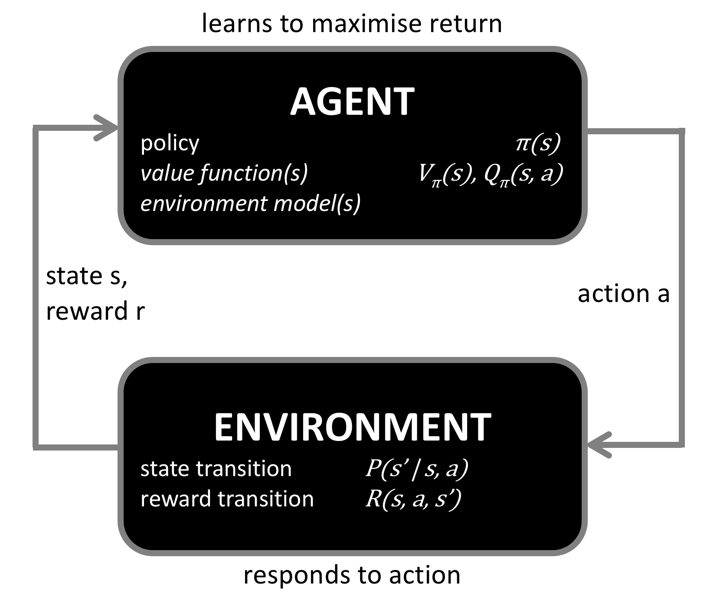

## a glance at reinforcement learning

adam green 

email - [adam.green@adgefficiency.com](adam.green@adgefficiency.com)

---

## Zero - Introduction

agenda

about me

goals for this course

where to go next

---

## One - Background

Expectations

Conditionals

Variance & bias

Bootstrapping

IID

Function approximation

---

## One - Few things about neural networks

Learning rate

Batch size

Scaling / preprocessing

---

### Two - Introduction to Reinforcement Learning

Context within machine learning

---

### Markov Decision Processes

{ width=50%, height=50% }

---

### Four challenges

**one - exploration vs exploitation**

how good is my understanding of the range of options

**two - data quality**

biased sampling, non-stationary distribution

**three - credit assignment**

which action gave me this reward

**four - sample efficiency**

learning quickly, squeezing information from data

---

### Three - Value functions

$V(s)$ vs $Q(s,a)$

Using a value function

Bellman Equation

Dynamic programming

Monte Carlo

Temporal difference

---

### Three - Value functions

SARSA

Q-Learning

DQN

---

### Four - DQN extensions

Eligibiliy traces

Prioritized experience replay

DDQN

Distributional Q-Learning

Rainbow

---

### Five - Policy gradients

Motivations

Discrete & continuous action spaces

The score function

Actor-critic

DPG

A3C

---

### Six - AlphaGo

Comparison with DeepBlue

MCTS

AlphaGo Zero

---

### Seven - Practical concerns

Should I use RL for my problem?

Mistakes and lessons

Best practices

---

### Eight - State of the art

Open AI DOTA

World Models

Deep RL doesn't work yet

Inverse reinforcement learning
