---
## a glance at reinforcement learning

### Adam Green
### [adam.green@adgefficiency.com](adam.green@adgefficiency.com)
### [adgefficiency.com](http://adgefficiency.com)
---
### Course Materials

[All course materials are in the GitHub repo dsr_rl](https://github.com/ADGEfficiency/dsr_rl)

- lecture notes hosted on GitPages
- useful machine learning & reinforcement learning literature
- practical work - collection of scripts to run DQN on Cartpole and some additional Python tips & tricks

---
### Agenda - Today

**today - morning**

[one - background & terminology](#section-one)

[two - introduction to reinforcement learning](#section-two)

[three - value functions & DQN](#section-three)

**today - afternoon**

[DQN practical](#section-practical)

---
### Agenda - Tomorrow

**tomorrow - morning**

[four - improvements to DQN](#section-four)

[five - policy gradients & Actor Critic](#section-five)

[six - AlphaGo & AlphaGo Zero](#section-six)

[seven - practical concerns](#section-seven)

[eight - a quick look at the state of the art](#section-eight)

**tomorrow - afternoon**

Misc advice + portfolio projects

---
### About Me

**Education**

B.Eng Chemical Engineering

MSc Advanced Process Design for Energy

DSR Batch 9

**Industry**  

Energy Engineer at ENGIE UK

Energy Data Scientist at Tempus Energy

---
### Goals for today and tomorrow

Introduction to **concepts, ideas and terminology** of reinforcement learning

Familiarity with important literature

Experience with running reinforcement learning experiments

Guidance on reinforcement learning project ideas

---
### Goals for today and tomorrow
To really learn RL, you will need to dedicate significiant amount of time (same as if you want to learn NLP, convolution, GANs etc)

These slides are designed as both a **future reference** and slides for today

---
### Where to start

- [Sutton & Barto - An Introduction to Reinforcement Learning (2nd Edition is in
  progress)](http://incompleteideas.net/book/bookdraft2017nov5.pdf)

- [David Silver's 10 lecture series on YouTube](https://www.youtube.com/watch?v=2pWv7GOvuf0)

- [Li (2017) Deep Reinforcement Learning: An Overview](https://arxiv.org/abs/1701.07274)

---
## one <a id="section-one"></a>
### nomenclature & definitions
### background and terminology
---

### Nomenclature

Nomenclature in RL can be somewhat inconsistent - often quite different for value function methods versus policy gradient methods

Following [Thomas & Okal (2016) A Notation for Markov Decision Processes](https://arxiv.org/pdf/1512.09075.pdf)

---

|symbol | variable  |
|---|---|
|$s$ |state     |
|$s'$|next state|
|$a$ |action    |
|$r$ |reward    |
|$G_t$ | discounted return after time t|
|$\gamma$ |  discount factor [0, 1) |
|$ a \sim \pi(s) $  | sampling action from a stochastic policy |
|$ a = \pi(s)$ | determinstic policy |
|$ \pi^\star $ | optimal policy |
|$ V_t\pi (s)$| value function |
|$ Q_t\pi (s,a)$| value function |
|$ \theta , \omega $ | function parameters (i.e. weights) |
|$ \mathbf{E}[f(x)] $  | expectation of f(x) |

---
### Expectations

Weighted average of all possible values - i.e. the mean

`Expected_value = probability * magnitude`

$$ \mathbf{E} [f(x)] = \sum p(x) \cdot f(x) $$

The important thing about expectations is that they **allow us to approximate by sampling**

i.e. if we want to approximate the average time it takes us to get to work 

we can measure how long it takes us for a week and get an approximation by averaging each of those days

---
### Conditionals

**Probability of one thing given another**

probability of next state and reward given state & action

$$ P(s'|s,a) $$  

reward received from a state & action

$$ R(r|s,a,s') $$  

Sampling an action from a stochastic policy conditioned on being in state s

$$ a \sim \pi (s|a) $$

---
### Variance & bias in supervised learning

Model generalization error = <span style="color:red">bias + variance + noise</span>

**Variance**

- error from sensitivity to noise in data set
- seeing patterns that aren’t there -> overfitting

**Bias**

- error from assumptions in the learning algorithm
- missing relevant patterns -> underfitting

---
### Variance & bias in RL 

**Variance** = deviation from expected value

- how consistent is my model / sampling
- can often be dealt with by sampling more
- high variance = sample inefficient

**Bias** = expected deviation vs true value

- how close to the truth is my model
- approximations or bootstrapping tend to introduce bias
- biased away from an optimal agent / policy

---?image=assets/variance_bias.png&size=auto 90%

---
### Bootstrapping

Doing something on your own 
- i.e. funding a startup with your own capital

Using a function to improve / estimate itself

The Bellman Equation is bootstrapped equation

$$ V(s) = r + \gamma V(s') $$

$$ Q(s,a) = r + \gamma Q(s', a') $$

Bootstrapping often introduces bias 
- the agent has a chance to fool itself 

---
### Function approximation


---
### Lookup tables
A system with two dimensions in the state variable

```
state = np.array([temperature, pressure])
```

|state |temperature | pressure | estimate |
|---|
|0   |high   |high   |unsafe   |
|1   |low   |high   |safe   |
|2  |high   |low   |safe   |
|3   |low   |low   |very safe   |

---
### Lookup tables

**Advantages**

Stability

Each estimate is independent of every other estimate

**Disadvantages**

No sharing of knowledge between similar states/actions

Curse of dimensionality 

High dimensional state/action spaces means lots of entries

---
### Linear functions

$$ V(s) = 3s_1 + 4s_2 $$

**Advantages**

Less parameters than a table

Can generalize across states

**Disadvantages**

The real world is often non-linear

---

###  Non-linear functions

Most commonly neural networks

**Advantages**

Model complex dynamics

Convolution for vision

Recurrency for memory / temporal dependencies

**Disadvantages**

Instability

Difficult to train

---
### iid

Fundamental assumption in statistical learning

**Independent and identically distributed**

In statistical learning one always assumes the training set is independently drawn from a fixed distribution

---
### A few things about training neural networks

**Learning rate

Batch size

Scaling / preprocessing**

Does anyone know what these are?

How do they affect each other?

---
### Learning rate

Controls the strength of weight updates performed by the optimizer (SGD, RMSprop, ADAM etc)

Small learning rate = slow training

High learning rate = overshoot or divergence

Learning rate is the most important hyperparameter - you should always intentionally set it

---
### Batch size

Modern reinforcement learning trains neural networks using batches of samples

1 epoch = 1 pass over all samples

i.e. 128 samples, batch size=64
-> two forward & backward passes across net

---
### Batch size

Smaller batch sizes = less memory on GPU

Batches train faster 
- weights are updated more often for each epoch

The cost of using batches is a less accurate estimate of the gradient 
- this noise can be useful to escape local minima

Bigger batch size = larger learning rate

This is because a larger batch size gives a more accurate estimation of the gradient

---
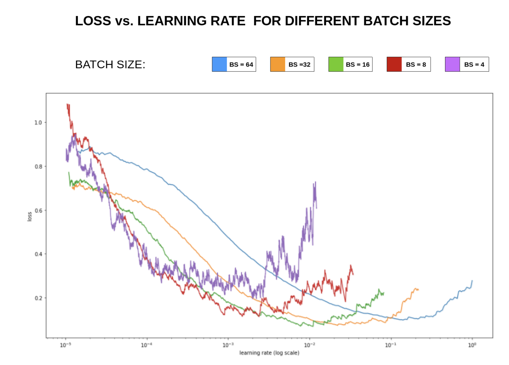

*https://miguel-data-sc.github.io/2017-11-05-first/*

---
### Scaling aka pre-processing

Neural networks don't like numbers on different scales  

Improperly scaled inputs or targets can cause issues with gradients

Anything that touches a neural network needs to be within a reasonable range

In supervised learning we can estimate statistics like min/max/mean from the training set

In reinforcment learning we have no training set!

---
### Scaling aka pre-processing

**Standardization** = removing mean & scale by unit variance

$$ \phi(x) = x - \frac{\mu(x)}{\sigma(x)} $$

Our data now has a mean of 0, and a variance of 1

**Normalization** = min/max scaling

$$ \phi(x) = \frac{x - x\_{min}}{x\_{max} - x\_{min}} $$

Our data is now within a range of 0 to 1

---
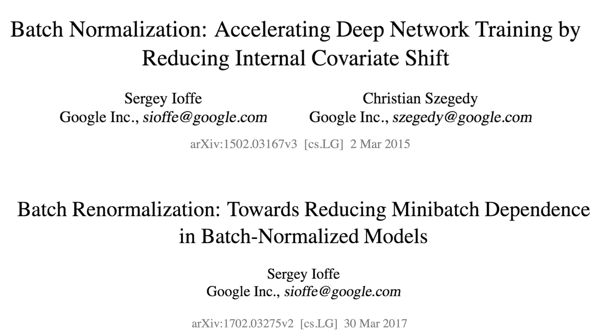

---
### Batch normalization

Batch norm. is used in both supervised & reinforcment learning.  It's additional preprocessing of data as it moves between network layers

We use the mean and variance of the batch to normalize activations (note - standardization is actually used!)

This reduces sensitivty to weight & bias initialization

It also allows us to use higher learning rates

---
### Batch renormalization

Vanilla batch norm. struggles with small or non-iid batches - the mean/variance/min/max estimtates are worse

Vanilla batch norm. uses two different methods for normalization for training & testing

Batch renormalization attempts to fix this by using a single algorithm for both training & testing

---
## two <a id="section-two"></a>
### introduction to reinforcement learning
### four central challenges
### Markov Decision Processes
---
### Machine learning


---
### Model free reinforcment learning


---
###  Also worth knowing about are

**Evolutionary methods** 
- better able to deal with sparse error signals 
- eaisly parallelizable

More general optimization methods such as **cross entropy method** are often reccomended to be tried before you try RL

Classicial decision making methods such as **linear programming** are also useful

---
###  Applications

RL is all about **decision making**.


[*David Silver – Deep Reinforcement Learning*](http://www0.cs.ucl.ac.uk/staff/d.silver/web/Resources_files/deep_rl.pdf)

---
###  Biological inspiration

Sutton & Barto - Reinforcment Learning: An Introduction
>Of all the forms of machine learning, reinforcement learning is the closest to the kind of learning that humans and other animals do, and many of the core algorithms of reinforcement learning were originally inspired by biological learning systems 

Mnih et. al (2015) Human-level control through deep reinforcement learning
>Neurobiological evidence that reward signals during perceptual learning may influence the characteristics of representations within the primate visual cortex 

---
### Habit formation

Cue -> Routine -> Reward

State -> Action -> Reward

---
###  Reinforcement learning is not

NOT an alternative method to use instead of a random forest, neural network etc

“I’ll try to solve this problem using a convolutional nn or RL” **this is nonsensical**

Neural networks (supervised techniques in general) are a tool that reinforcement learners can use to learn or approximate functions

---
###  Deep reinforcement learning

**Deep learning** = neural networks with multiple layers

**Deep reinforcement learning** = using multiple layer networks to approximate policies or value functions

Feedforward, convolutional or recurrent neural networks are all used within different RL algorithms

---
###  A new level of intelligence

Founder & CEO of DeepMind Demis Hassabis on the brilliance of AlphaGo in it's 2015 series

<iframe width="854" height="480" src="https://www.youtube.com/embed/i3lEG6aRGm8?start=1632" frameborder="0" allow="autoplay; encrypted-media" allowfullscreen></iframe>

---
## Reinforcement Learning

### is

## learning through action

---


---


---
### Supervised learning versus reinforcement learning

In supervised learning we are limited by our dataset

In reinforcement learning we can generate more data by acting

> Deep RL is popular because it’s the only area in ML where it’s socially acceptable to train on the test set

Data = the agent's experience $(s,a,r,s')$

It's not clear what we should do with this data - no implicit target

---
### Reinforcement learning dataset

The dataset we generate is the agent's memory

$$[experience,$$
$$experience,$$
$$...$$
$$experience]$$

$$[(s_0, a_0, r_1, s_1), $$ 
$$(s_1, a_1, r_2, s_2), $$
$$...$$
$$(s_n, a_n, r_n, s_n)] $$

What should we do with this dataset?

---
### Four central challenges 

one - exploration vs exploitation

two - data quality

three - credit assignment

four - sample efficiency

---
### Exploration vs exploitation
Do I go to the restaurant in Berlin I think is best – or do  I try something new?

- exploration = finding information
- exploitation = using information

Agent needs to balance between the two
- we don't want to waste time exploring poor quality states
- we don't want to miss high quality states

---
### Exploration vs exploitation

How stationary are the environment state transition and reward functions?  How stochastic is my policy?

Design of reward signal vs. exploration required
- algorithm does care about the time step
- too small = rewards are delayed = credit assignment harder
- too large = coarser control 

---
### Data quality

Remember our two assumptions in iid - independent sampling & identical distribution.  

RL breaks both in multiple ways:

**Independent sampling**
- all the samples collected on a given episode are correlated (along the state trajectory)
- our agent will likely be following a policy that is biased

**Identically distributed**
- learning changes the data distribution
- exploration changes the data distribution 
- environment can be non-stationary

---
## Reinforcement learning will always break supervised learning assumptions about data quality

---
###  Credit assignment

The reward we see now might not be because of the action we just took

Reward signal is often
- **delayed** - benefit/penalty of action only seen much later  
- **sparse** - experience with reward = 0

Sometimes we can design a more dense reward signal for a given environment

---
### Sample efficiency
How quickly a learner learns

How often we reuse data
- do we only learn once or can we learn from it again
- can we learn off-policy

How much we squeeze out of data
- i.e. learn a value function, learn a environment model

Requirement for sample efficiency depends on how expensive it is to generate data
- cheap data -> less requirement for data efficiency
- expensive / limited data -> squeeze more out of data

---
### Four challenges
**exploration vs exploitation**
 how good is my understanding of the range of options

**data**
 biased sampling, non-stationary distribution

**credit assignment**
which action gave me this reward

**sample efficiency**
 learning quickly, squeezing information from data

---
### Markov Decision Processes

Mathematical framework for the reinforcement learning problem

The Markov property is often a requirement to gurantee convergence

---
### Markov property

Future is conditional only on the present

Can make prediction or decisions using only the current state

Any additional information about the history of the process will not improve our decision

$$ P(s\_{t+1} | s\_{t}, a\_{t}) = P(s\_{t+1}|s\_t,a\_t...s\_0,a\_0)$$

---
### Formal definition of a MDP

$$ (\mathcal{S}, \mathcal{A}, \mathcal{R}, P, R, d_0, \gamma) $$

Set of states $\mathcal{S}$

Set of actions $\mathcal{A}$

Set of rewards $\mathcal{R}$

State transition function $ P(s'|s,a) $

Reward transition function $ R(r|s,a,s') $  

Distribution over initial states $d_0$

Discount factor $\gamma$

---
### Object oriented definition of a MDP

Two objects - the agent and environment

Three signals - state, action & reward

``` python
class Agent

class Environment

state = env.reset()

action = agent.act(state)

reward, next_state = env.step(action)
```

---
### Environment

Can be real or virtual 
- modern RL uses virtual environments to generate lots of experience

Each environment has a state space and an action space
- these spaces can be discrete or continuous

Environments can be 
- episodic (terminating at a certain point) 
- non-episodic (continuous)

The MDP framework unites both in the same way by using the idea of a final absorbing state at the end of episodes

---
### Discretiziation

Too coarse -> non-smooth control output

Too fine -> curse of dimensionality = computational expense

Discretization requires some prior knowledge

When we discretize we lose the shape of the space

---
### State

Infomation for the agent to **choose next action** and to **learn from**

State is a flexible concept - it's a n-d array

``` python
state = np.array([temperature, pressure])

state = np.array(pixels).reshape(height, width, channels)
```

Possible to concactenate sequential samples together to give some idea of the recent trajectory

---
### State versus observation

Many problems your agent won't be able to see everything that would help it learn - i.e. non-Markov

This then becomes a POMDP - partially observed MDP

``` python
state = np.array([temperature, pressure])

observation = np.array([temperature + noise])
```

---
### Reward

Scalar

Delayed

Sparse

A well defined reward signal is often a limit for applications of RL 
- i.e. autonomous driving - whats the reward?

---
### Agent

Our agent is the **learner and decision maker**

It's goal is to maximize total discounted reward

An agent always has a policy - even if it's a bad one 

---
### The reward hypothesis

Maximising return is making an assumption about the nature of our goals

We are assuming that *goals can be described by the maximization of expected cumulative reward*

Do you agree with this?

---
### Policy $\pi(s)$

A policy is rules to select actions

$$pi(s)$$

$$\pi(s,a|\theta)$$

$$\pi_\theta(s|a)$$

Example policies
- act randomly
- always pick a specific action
- the optimal policy - the policy that maximizes future reward

Policies can be deterministic or stochastic

Policy can be
- parameterized directly (policy gradient methods)
- generated from a value function (value function methods)

---
### Prediction versus control

Prediction 
- understanding a fixed or given policy

Control 
- finding the optimal policy
- the policy that maximizes expected future discounted reward

### On versus off policy learning

On policy 
- learn about the policy we are using to make decisions 

Off policy 
- evaluate or improve one policy while using another to make decisions

Possible to do control on or off policy - using general policy iteration

---


---
### Environment model

Our agent can learn an environment model

Predicts environment response to actions
- predicts $s,r$ from $s,a$

```python
def model(state, action):

# do stuff

    return next_state, reward
```

Sample vs. distributional model

Model can be used to simulate trajectories for **planning**

---


*Sutton & Barto - Reinforcement Learning: An Introduction*

---


---

### Return

Goal of our agent is to maximize reward

Return ($G_t$) is the total discounted future reward

$$G\_t = r\_{t+1} + \gamma r\_{t+2} + \gamma^2 r\_{t+3} + ... = \sum\_{k=0}^{\infty} \gamma^k r\_{t+k+1}$$

` return = reward + discount * reward + discount^2 * reward ...`

**Why do we discount future rewards?**

---
### Discounting

Future is uncertain - stochastic environment

Matches human thinking - hyperbolic discounting

Finance - time value of money

Makes return for infinite horizon problems finite

If our discount rate is $[0,1)$ then we can make the sum of an infinite series finite (known as a geometric series)

Can use discount = 1 for
- games with tree-like structures (without cycles)
- when time to solve is irrelevant (i.e. a board game)
---
## three <a id="section-three"></a> 
### value functions 
### Bellman Equation 
### approximation methods
### SARSA & Q-Learning
### DQN
---


---

### Value function

<center>$V_\pi(s)$</center>

**how good is this state**

### Action-value function

<center>$Q_\pi(s,a)$</center>

**how good is this action**

---
### Value functions

**Value function**

$ V_{\pi}(s) = \mathbf{E}[G_t | s_t] $ 

Expected return when in state $s$, following policy $\pi$

**Action-value function**

$ Q_{\pi}(s,a) = \mathbf{E}[G_t | s_t, a_t] $ 

Expected return when in state $s$, taking action $a$, following policy $\pi$

---
### Value functions are oracles

Value functions are predictions of the future 
- they are expectations
- predict expected future discounted reward
- always conditioned on a policy

But we don’t know this function 
- agent must learn it 
- once we learn it – how will it help us to act?
---
### Generating the optimal policy from the optimal value function

Imagine we were given the optimal value function $Q_*(s,a)$

We are in state $s$, and our set of actions $\mathcal{A} = \{a_1, a_2, a_3\}$

We can use our optimal value function to calculate the optimal expected discounted return for each action

We then select the action with the largest $Q(s,a)$ - ie take the $\underset{a}{\arg\max} Q(s,a)$

This is known as a *greedy policy*

---
### Generating the optimal policy from the optimal value function

``` python
def greedy_policy(state):
    q_values = value_function.predict(state)

    action = np.argmax(q_values)

    return action
```

---
### Policy approximation versus policy improvement

We can see that having a good approximation of the optimal value function helps us to improve our policy

These are two distinct steps

1 - improving the predictive power of our value function

2 - improving the policy - i.e. improving the actions that we take based on our value function

---
### Policy & value iteration

$$V\_{k+1} (s) = \max\_a \sum\_{s',r} P(s',r|s,a) [r + \gamma V\_k(s')]$$

These two steps are done sequentially in a process known as **policy iteration**
- approximate our policy (i.e. $V_{\pi}(s)$)
- improve our policy by being greedy
- approximate our new better policy
- act greedy 

A similar by slightly different process is **value iteration**, where we combine the policy approximation and improvement steps by using a maximization over all possible next states in the update


---
### Generalized policy iteration
GPI = the general idea of letting policy evaluation and improvement processes interact  

Policy iteration = sequence of approximating value function then making policy greedy wrt value function

Value iteration = single iteration of policy evaluation done inbetween each policy improvement

Both of these can achieve the same result - stabilizing when a policy has been found that is greedy wrt it's own value function

GPI = value function approximates the policy, then we improve the policy wrt this improved value function, which improves the policy

Idea is that the approximate policy and value functions interact in a way that both move towards their optimal values - this is one souce of non-stationary learning in RL

---
### Generalized policy iteration

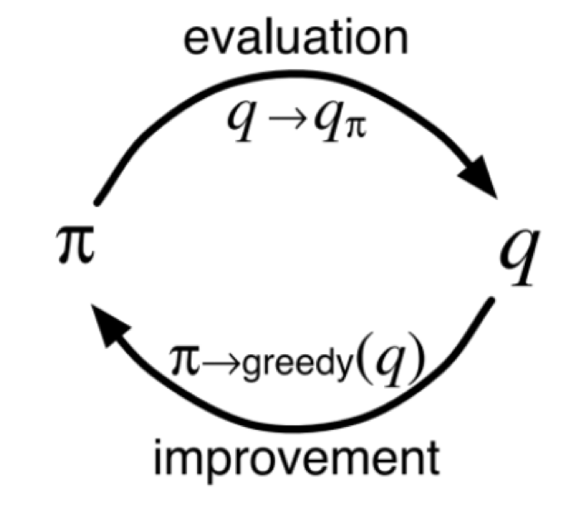

---
### Value function approximation

To approximate a value function we can use one of the methods we looked at in the first section
- lookup table
- linear function
- non-linear function

Linear functions are appropriate with some agents or environments

Modern reinforcement learning is based on using neural networks 

---
### Richard Bellman


Invented dynamic programming in 1953 

---
### Richard Bellman

*[On the naming of dynamic programminging](ttp://arcanesentiment.blogspot.com.au/2010/04/why-dynamic-programming.html)*
> I was interested in planning, in decision making, in thinking. But planning, is not a good word for various reasons. I decided therefore to use the word, ‘programming.’ I wanted to get across the idea that this was dynamic, this was multistage, this was time-varying...

Also introduced the curse of dimensionality 
- number of states $\mathcal{S}$ increases exponentially with number of dimensions in the state

---
###  Bellman Equation

Bellman's contribution is remembered by the Bellman Equation

$$ G\_{\pi}(s) = r + \gamma G\_{\pi}(s') $$

The Bellman equation relates the expected discounted return of the current state to the discounted value of the next
state

The Bellman equation is a recursive definition - it is bootstrapped

We can apply it to value functions

$$ V\_{\pi}(s) = r + \gamma V\_{\pi}(s') $$

$$ Q\_{\pi}(s,a) = r + \gamma Q\_{\pi}(s', a') $$

---
### How does the Bellman Equation help us learn?

In supervised learning you train a neural network by minimizing the difference between the network output and the correct target for that sample

In order to improve our approximation of a value function (i.e. a neural network) we need to create a target for each sample of experience

We can then improve our approximation by minimizing a loss function

$$ loss = target - approximation $$

For an experience sample of $(s, a, r, s')$
$$ loss = r + Q(s',a) - Q(s,a) $$

This is also known as the **temporal difference error**

---
## break

---
## three
### introduction to value functions 
### Bellman Equation 
### approximation methods
### SARSA & Q-Learning
### DQN
---
### Approximation methods

We are going to look at three different methods for approximation

1. dynamic programming
2. Monte Carlo
3. temporal difference

Policy improvement can be done by either policy iteration or value iteration for all of these different approximation methods

What these methods are doing is **creating targets** to learn from

---
### Dynamic programming

Imagine you had a perfect environment model

- the state transition function $ P(s'|s,a) $ 
- the reward transition function $ R(r|s,a,s') $  

Can we use our perfect environment model for value function approximation?

---


Note that the probabilities here depend both on the environment and the policy

---
### Dynamic programming backup

We can perform iterative backups of the expected return for each state

The return for all terminal states is zero

$$V(s_2) = 0$$

$$V(s_4) = 0$$

We can then express the value functions for the remaining two states

$$V(s\_3) = P\_{34}[r\_{34} + \gamma V(s\_4)$$

$$V(s\_3) = 1 \cdot [5 + 0.9 \cdot 0] = 5 $$

$$V(s\_1) = P\_{12}[r\_{12} + \gamma V(s\_2) + P\_{13}[r\_{13} + \gamma V(s\_3)]$$

$$V(s\_1) = 0.5 \cdot [1 + 0.9 \cdot 0] + 0.5 \cdot [2 + 0.9 \cdot 5] = 3.75 $$

---
### Dynamic programming

Our value function approximation depends on
- our policy (what actions we pick)
- the environment (where our actions take us and what rewards we get)
- our current estimate of $V(s')$

A dynamic programming update is expensive - our new estimate $V(s)$ depends on the value of all other states (even if the probability is zero)

Asynchronous dynamic programming addresses this by updating states in an arbitrary order

---
### Dynamic programming summary

Requries a **perfect environment model** 
- we don't need to sample experience at all 
- we don't ever actually take actions)

We make **full backups** 
- the update to the value function is based on the probability distribution over all possible next states

**Bootstrapped** 
- we use the recursive Bellman Equation to update our value function

Limited utility in practice but they provide an **essential foundation** for understanding reinforcement learning 
- all RL can be thought of as attempts to achieve what DP can but without a model and with less computation

---
### Monte Carlo

Monte Carlo methods = finding the expected value of a function of a random variable

---
### Monte Carlo in RL

**No model** 
- we learn from actual experience 

We can also learn from **simulated experience** 
- we don't need to know the whole proability distribution 
- just be able to generate sample trajectories

**No boostrapping** 
- we take the average of the true discounted return

**Episodic only** 
- because we need to calcuate the true discounted return

---
### Monte Carlo approximation

Estimate the value of a state by averaging the true discounted return observed after each visit to that state

As we run more episodes, our estimate should converge to the true expectation

Low bias & high variance - why?

---
### Bias & variance of Monte Carlo

High variance
- we need to sample enough episodes for our averages to converge
- can be a lot for stochastic or path dependent environments

Low bias
- we are using actual experience
- no chance for a bootstrapped function to mislead us

---
### Monte Carlo algorithm

Algorithm for a lookup table based Monte Carlo approximation

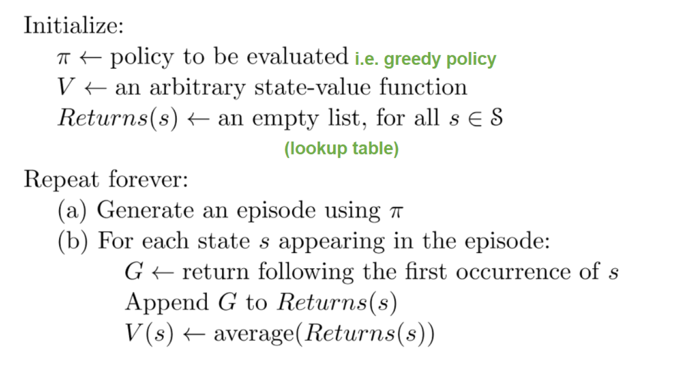

---
###  Interesting feature of Monte Carlo

Computational expense of estimating the value of state $s$ is independent of the number of states $\mathcal{S}$ 

This is because we use experienced state transitions


---
### Monte Carlo

Learn from **actual or simulated experience** 
- no environment model

**No bootstrapping** 
- use true discounted returns sampled from the environment

**Episodic problems only** 
- no learning online

Ability to **focus** on interesting states and ignore others

High variance & low bias

---
### Temporal difference 

Learn from **actual experience** 
- like Monte Carlo
- no environment model

**Bootstrap** 
- like dynamic programming
- learn online

Episodic & non-episodic problems

---
### Temporal difference

Use the Bellman Equation to approximate $V(s)$ using $V(s')$ 

Key to TD methods is the **temporal difference error**

$$error = actual - predicted $$

$$predicted = V(s) $$

$$actual = r + \gamma V(s') $$

$$error = r + \gamma V(s') - V(s) $$

Update rule for a table TD(0) approximation


---
### Temporal difference backup


$$ V(s\_1) \leftarrow V(s\_1) + \alpha [ r\_{23} + \gamma V(s\_3) - V(s\_1) ] $$

---
### You are the predictor

Example 6.4 from Sutton & Barto

Imagine you observe the following episodes 
- format of (State Reward, State Reward)
- i.e. A 0 B 0 = state A, reward 0, state B, reward 0

| Episode | Number times observed |
|---|---|
|A 0, B 0| 1 |
|B 1 | 6 |
|B 0 | 1 |

What are the optimal predictions for $V(A)$ and $V(B)$?

---
### You are the predictor

We can estimate the expected return from state $B$ by averaging the rewards

$$V(B) = 6/8 \cdot 1 + 2/6 \cdot 0 = 3/4 $$

What about $V(A)$?  

- We observed that every time we were in $A$ we got $0$ reward and ended up in $B$
- Therefore $V(A) = 0 + V(B) = 3/4$

or

- We observed a discounted return of $0$ each time we saw $A$ 
- therefore $V(A) = 0$

Which is the Monte Carlo approach, which is the TD approach?

---
### You are the predictor

Estimating $V(A) = 3/4$ is the answer given by TD(0)

Estimtating $V(A) = 0$ is the answer given by Monte Carlo

The MC method gives us the lowest error on fitting the data (i.e. minimizes MSE)

The TD method gives us the **maximum-likelihood estimate**

---
### You are the predictor

The maximum likelihood estimate of a parameter is the parameter value whose probabilty of generating the data is greatest

We take into account the transition probabilities, which gives us the **certanitiy equivilance estimate** - which is the estimate we get when assuming we know the underlying model (rather than approximating it)

---
### Recap


*Sutton & Barto - Reinforcement Learning: An Introduction*

---
## three
### introduction to value functions 
### Bellman Equation 
### approximation methods
### **SARSA & Q-Learning**
### DQN
---

### SARSA & Q-Learning

Approximation is all well and good - but we want to control

SARSA & Q-Learning are both based on the **action-value function** $Q(s,a)$

Q-Learning is the basis of DQN - the algorithm developed by DeepMind that sparked off the revolution in deep reinforcement learning

It's also the algorithm we will be playing with this afternoon

Why might we want to learn $Q(s,a)$ rather than $V(s)$?

---
### $V(s)$ versus $Q(s,a)$ 

Imagine a simple MDP

$$ \mathcal{S} = \{s_1, s_2, s_3\} $$

$$ \mathcal{A} = \{a_1, a_2\} $$

Our agent finds itself in state $s_2$

We use our value function $V(s)$ to calculate 

$$V(s_1) = 10$$
$$V(s_2) = 5$$
$$V(s_3) = 20$$

Which action should we take?  

--- 
### $V(s)$ versus $Q(s,a)$ 

Now imagine I gave you

$$Q(s\_{2}, a\_1) = 40$$
$$Q(s\_{2}, a\_2) = 20$$

It's now easy to pick the action that maximizes expected discounted return

$V(s)$ tells us how good a state is

$Q(s,a)$ tells us how good an **action** is

---
### SARSA

SARSA is an **on-policy** control method
- we learn about the policy we are following
- we improve the policy by being greedy to the value function $Q\_{\pi}(s,a)$

We use every element from our experience tuple $(s,a,r,s')$ 
- and also $a'$ - the next action selected by our agent

$$Q(s,a) \leftarrow Q(s,a) + \alpha [r + \gamma Q(s', a') - Q(s,a)] $$

Why is SARSA on-policy?

---
### SARSA

SARSA is on-policy because we are forced to learn about the action $a'$ that our agent choose to take 

Our value function is always for the policy we are following.  How then do we improve the policy?

We improve using general policy iteration (GPI) 
- approximate $Q(s,a)$ for our current policy
- act greedily towards this approximation of $Q(s,a)$
- approximate $Q(s,a)$ for our new experience
- act greedily towards this new approximation
- repeat

---
### Q-Learning

Q-Learning is an off-policy control method

Use every element from our experience tuple $(s,a,r,s')$

We don't need to know what action our agent took next (i.e. $a'$) 
- instead we take the **maximum over all possible actions**
- this allows us to learn the optimal value function 
- while following a sub-optimal policy (i.e. an exploratory policy)

$$Q(s,a) \leftarrow Q(s,a) + \alpha [r + \gamma \underset{a}{\max} Q(s', a') - Q(s,a)] $$

We never try to learn $Q_{\pi}$ - we always try to learn $Q^*$, the optimal policy

---
### SARSA & Q-Learning

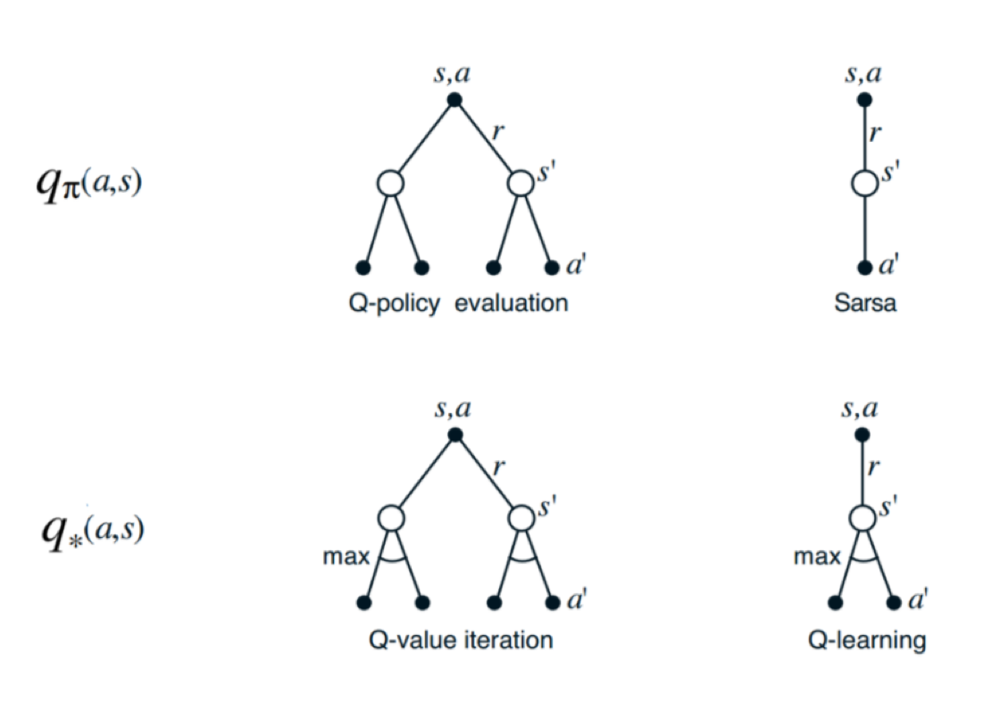

---
### Q-Learning

Selecting optimal actions in Q-Learning can be done by an $argmax$ across the action space

$$action = \underset{a}{argmax}Q(s,a)$$

The $argmax$ limits Q-Learning to **discrete action spaces only**

Acting in Q-Learning is also deterministic 
- we will always pick the action our $Q(s,a)$ approximation thinks is good

How then do we explore the environment?

---
### $\epsilon$-greedy exploration

One stragety to explore in Q-Learning is known as the **epsilon-greedy policy**

```
def epsilon_greedy_policy():
    if np.random.rand() < epsilon:
        #  act randomly
        action = np.random.uniform(action_space)

    else:
        #  act greedy
        action = np.argmax(Q_values)

    return action
```

$\epsilon$ is decayed during experiments as our approximation of $Q_*(s,a)$ improves
---
### Exploration strageties

Alternative policies include Boltzmann (i.e. a softmax) 
- temperature being annealed as learning progresses

More advanced is a Bayesian Neural Network 
- a network that maintains distributions over weights -> distribution over actions  
- this can also be performed using dropout to simulate a probabilistic network

[**Action-Selection Strategies for Exploration**](https://medium.com/emergent-future/simple-reinforcement-learning-with-tensorflow-part-7-action-selection-strategies-for-exploration-d3a97b7cceaf)

---


[Action-Selection Strategies for Exploration](https://medium.com/emergent-future/simple-reinforcement-learning-with-tensorflow-part-7-action-selection-strategies-for-exploration-d3a97b7cceaf)

---
### Problems with Q-learning

Correlations in our dataset (the list of experience tuples)
- combine this with bootstrapping and instability occurs

Small changes $Q(s,a)$ estimates can drastically change the policy 

$$Q(s_1, a_1) = 10 $$
$$Q(s_1, a_2) = 11 $$

Then we do some learning and our estimates change

$$Q(s_1, a_1) = 12 $$
$$Q(s_1, a_2) = 11 $$

Now our policy is completely different!  

---
### Deadly triad

Sutton & Barto discuss the concept of the **deadly triad** 
- three mechanisms that combine to produce instability and divergence

1. off-policy learning - to learn about the optimal policy while following an exploratory policy

2. function approximation - for scalability and generalization

3. bootstrapping - computational & sample efficiency

---
### Deadly triad

It's not clear which of the three cause instability
- dynamic programming can diverge with function approximation (so even on-policy learing can diverge)
- prediction can diverge
- linear functions can be unstable

Divergence is an emergent phenomenon

Up until 2013 the deadly traid caused instability when using Q-Learning with complex function approximators (i.e. neural networks)

---
## three
### introduction to value functions 
### Bellman Equation 
### approximation methods
### SARSA & Q-Learning
### **DQN**
---

### DQN

This section covers two papers that introduced (2013) and developed (2015) the Deep Q-Network (DQN) algorithm

- prior to 2013, Q-Learning was only stable in MDPs with lookup tables or linear function approximators
- attempts to use complex, non-linear function approximators (i.e. neural networks) all failed 
- learning was unstable and would often diverge

---
### DQN

In 2013 a small London startup published a paper 
- an agent based on Q-Learning 
- superhuman level of performance in three Atari games

In 2014 Google purchased DeepMind for around £400M

This is for a company with 
- **no product
- no revenue
- no customers 
- a few world class employees**

---


---
### Significance

**End to end deep reinforcement learning**

Learning from high dimensional input 
- raw pixels

Ability to **generalize**
- same algorithm, network strucutre and hyperparameters

Two key innovations 
1. experience replay (Lin 1993)
2. target network

---
### Reinforcement learning to play Atari

**State**

Last four screens concatenated together

Allows infomation about movement

Grey scale, cropped & normalized

**Reward**

Game score

Clipped to [-1, +1]

**Actions**

Joystick buttons (a discrete action space)

---
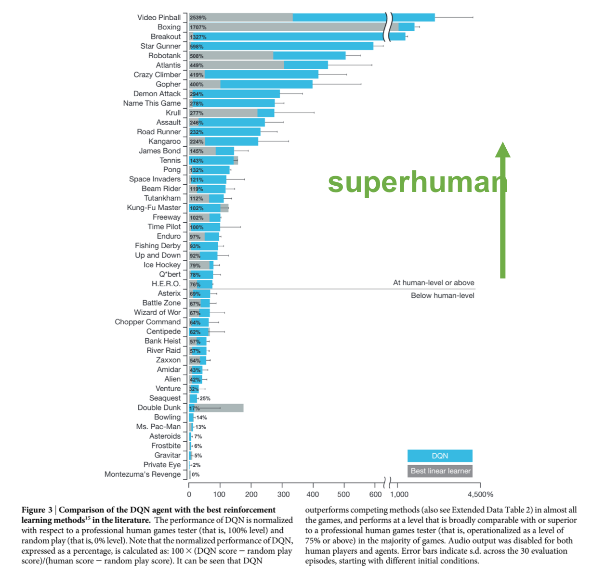

---


---


---
### Two key innovations

Experience replay

Target network

Both of these aim to improve learning stability 
- not to improve performance!

---
### Experience replay


---
### Experience replay

Experience replay helps to deal with our non-iid dataset 
- training using experience as sampled means each sample is correlated with the one before
- makes our sampling more independent
- also makes the distribution of the samples in the batch more evenly distributed

Data efficiency 
- we can learn from experience multiple times

Allows seeding of the memory with human expert experience

---
### Biological basis for experience replay

Hippocampus may support an experience replay process in the brain

Time compressed reactivation of recently experienced trajectories during offline periods

Provides a mechanism where value functions can be efficiently updated through interactions with the basal ganglia

*Mnih et. al (2015)*

---
### Target network

Second innovation behind DQN

Parameterize two separate neural networks (identical structure) - two sets of weights $\theta$ and $\theta^{-}$


Original Atari work copied the online network weights to the target network every 10k - 100k steps
- modern methods use a small factor tau ($\tau$) to smoothly update weights at each step

---
### Target network

Changing value of one action changes value of all actions & similar states 
- bigger networks less prone (less aliasing aka weight sharing)
 
Stable training 
- no longer bootstrapping from the same function, but from an old & fixed version of $Q(s,a)$ 

Reduces the correlation between the target used to train the network and the current network approximation 

---
### Stability techniques

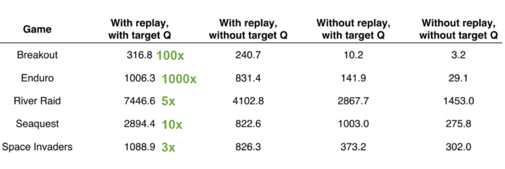

*Minh – Deep Q-Networks – Deep RL Bootcamp 2017*

---
### DQN algorithm


---
### Huber Loss

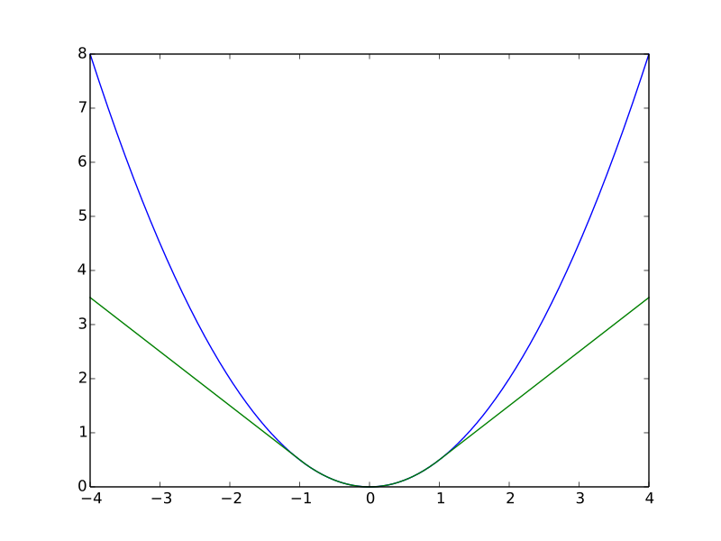

The Huber Loss is a form of gradient clipping

---
### Timeline

1989 - Q-Learning (Watkins)

1992 - Experience replay (Lin)

...

2013 - DQN

2015 - DQN (Nature)

2015 - Prioritized experience replay

2016 - Double DQN (DDQN)

2017 - Distributional Q-Learning

We will cover these improvements and more powerful algorithms tomorrow

---
## Lunch
---
### Practical <a id="section-practical"></a>

The practical we will do this afternoon is to play with a working DQN agent on the Open AI Cartpole environment.

The ideas behind this practical are
- in industry you won't be handed a set of notebooks to shift-enter through

- you will likely be given an existing code base and be expected to figure out how it works

- you will also need to learn to read other peoples code in the wild

- this skill is also useful for understanding open source projects

- using a working system allows you to understand the effect of hyperparameters

---
###  CartPole

<iframe width="560" height="315" src="https://www.youtube.com/embed/46wjA6dqxOM?rel=0&loop=1&autoplay=1&controls=0&showinfo=0" frameborder="0" allow="autoplay; encrypted-media" allowfullscreen></iframe>

CartPole-v0 defines "solving" as getting average reward of 195.0 over 100 consecutive trials.

---
### Hyperparameters

Hyperparameters are configured using a dictionary
- using dictionaries to setup agents/experiments allows you to eaisly save them to a text file
- you can also explode a dictionary into a function

```
config = {'param1': 10, 'param2': 12}

def expt(param1, param2):
    return param1 * param2

>>> expt(**config)
120
```

---
### Hyperparameters

What do you think the effect of changing each of these hyperparameters will be?

```
config_dict = {'discount': 0.97,
               'tau': 0.001,
               'total_steps': 500000,
               'batch_size': 32,
               'layers': (50, 50),
               'learning_rate': 0.0001,
               'epsilon_decay_fraction': 0.3,
               'memory_fraction': 0.4,
               'process_observation': False,
               'process_target': False}
```

---
## four <a id="section-four"></a>
### eligibility traces
### prioritized experience replay
### DDQN
### Rainbow

---


[*The Long-term of AI & Temporal-Difference Learning – Rich Sutton*](https://www.youtube.com/watch?v=EeMCEQa85tw)

---


[*The Long-term of AI & Temporal-Difference Learning – Rich Sutton*](https://www.youtube.com/watch?v=EeMCEQa85tw)

---
### Eligibility traces

Eligibility traces are the family of methods **between Temporal Difference & Monte Carlo**

Eligibility traces allow us to assign TD errors to different states other than the current state
- can be useful with delayed rewards or non-Markov environments
- requires more computation 
- squeezes more out of data

---
### The space between TD and MC

In between TD and MC exist a family of approximation methods known as **n-step returns**


*Sutton & Barto*

---
### The forward and backward view

We can look at eligibility traces from two perspectives

The **forward** view
- the forward view is helpful for understanding the theory

The **backward** view
- the backward view we can put into practice

---
### The forward view

We can decompose our return into **complex backups**
- looking forward to future returns to create the return from the current state
- can use a combination of experience based and model based backups 

$$R\_t = \frac{1}{2} R\_{t}^{2} + \frac{1}{2} R\_{t}^{4} $$

$$R\_t = \frac{1}{2} TD + \frac{1}{2} MC $$


*Sutton & Barto*

---
### $$TD(\lambda)$$

The family of algorithms between TD and MC is known as $TD(\lambda)$
- weight each return by $\lambda^{n-1}$ 
- normalize using $(1-\lambda)$

$$ TD(\lambda) = (1-\lambda) \sum_{n-1}^{\infty} \lambda^{n-1} R_t^n $$

$$\lambda = 0$$ -> TD(0) 

$$\lambda = 1$$ -> Monte Carlo

$TD(\lambda)$ and n-step returns are the same thing

---
### The backward view

The forward view is not practical - it requires knowledge of the future!

The backward view approximates the forward view

It requires an additional variable in our agents memory 
- the eligibility trace $e_{t}(s)$

At each step we decay the trace according to

$$ e\_{t}(s) = \gamma \lambda e\_{t-1}(s) $$

Unless we visited that state, in which case we accumulate more eligibility

$$ e\_{t}(s) = \gamma \lambda e\_{t-1}(s) + 1 $$

---
### The backward view


*Sutton & Barto*

---
### Traces in a grid world


*Sutton & Barto*

- one step method would only update the last $Q(s,a)$
- n-step method would update all $Q(s,a)$ equally
- eligibility traces updates based on how recently each $Q(s,a)$ was experienced

---
### Experience replay


---
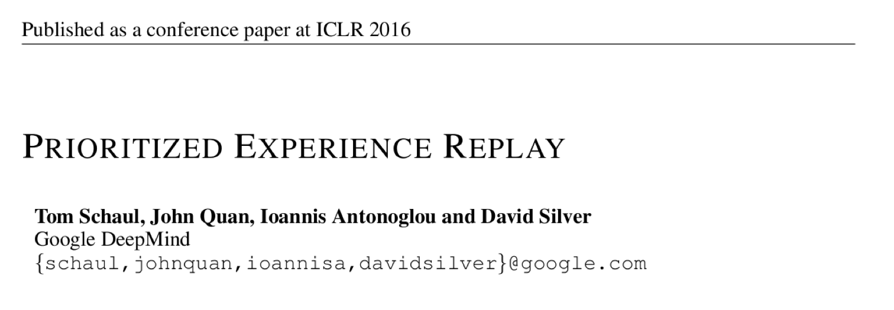

---
### Prioritized Experience Replay

Naive experience replay **randomly samples experience** 
- learning occurs at the same frequency as experience

Some samples of experience are more useful for learning than others
- we can measure how useful experience is by the temporal difference error

$$ error = r + \gamma Q(s', a) - Q(s,a) $$

TD error measures suprise 
- this transition gave a higher or lower reward than expected

---
### Prioritized Experience Replay

Non-random sampling introduces two problems

1. loss of diversity - we will only sample from high TD error experiences 2. introduce bias - non-independent sampling Schaul et. al (2016) solves these problems by

1. correct the loss of diversity by making the prioritization stochastic
2. correct the bias using importance sampling

---
### Stochastic prioritization

Noisy rewards can make the TD error signal less useful

$p_i$ is the priority for transition $i$

$$ \frac{p\_{i}^{\alpha}}{\sum\_{k}p\_{k}^{\alpha}} $$

$\alpha = 0 $ -> uniform random sampling

Schaul suggets alpha $~ 0.6 - 0.7$

---
### Importance sampling

Not a sampling method 
- it's a method of Monte Carlo approximation


Monte Carlo approximates using the sample mean
- assuming that the sampling distribution $x\_p$ 
- is the same as the true distribution $(x~p)$ 

$$ \mathbb{E}[f(x)] = 1/n \sum f(x\_{i}) $$

Could we use infomation about another distribution $q$ to learn the distribution of $p$
- correct for the fact that we are using another distribution

*https://www.youtube.com/watch?v=S3LAOZxGcnk*
---

### Importance sampling

The importance weight function

$$ w(x) = \frac{p(x)}{q(x)}$$

$$ \mathfb{E}[f(x)] = \frac{1}{n} \sum \frac{f(x\_i)}{w(x\_i)} $$

This is an unbiased approximation
- can also be lower variance than using the sample distribution $p$

---
### Importance sampling in prioritized experience replay

$$\omega\_{i} = \left( \frac{1}{N} \cdot \frac{1}{P(i)} \right)^{\beta}$$

$\beta$ 
- hyperparameter that is increased over the course of an experiment
- 0.4 or 0.5 up to 1.0

Weights are normalized by $ 1 / \max_i \omega_i $ to ensure that we only scale the update downwards

All new transitions are stored at maximum priority - to ensure replay at least once

Sampling is commonly done using **binary heaps** to efficiently search for high prioritiy transitions and to calculate sums
and minimums

Ask your algorithms teacher to go over binary heaps - they are useful!

---
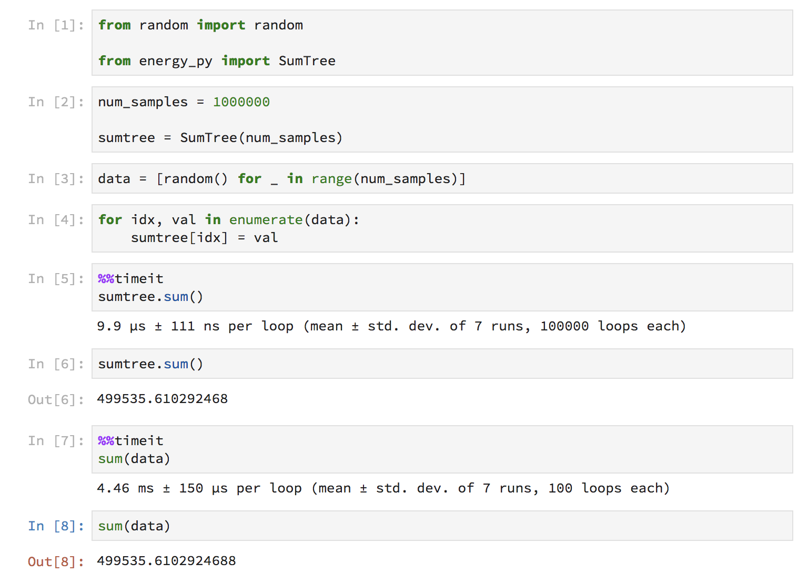

---
## four
### eligibility traces
### prioritized experience replay
### **DDQN**
### Rainbow

---

---

### DDQN

DDQN = Double Deep Q-Network
- first introducued in a tabular setting in 2010
- then reintroduced in the content of DQN in 2016

DDQN aims to overcome the **maximization bias** that occurs due to the max operator in Q-Learning

---
### Maximization bias

Imagine a state where $Q(s,a) = 0$ for all $a$

Our estimates of the value of this state are normally distributed above and below 0


---
### Double Q-Learning

2010 paper parameterizes two networks $Q^A$ and $Q^B$

Actions are taken by averaging the estimates of both Q functions

Learning is done by 
- selecting the optimal action for one function 
- but using the estimated value for the other function

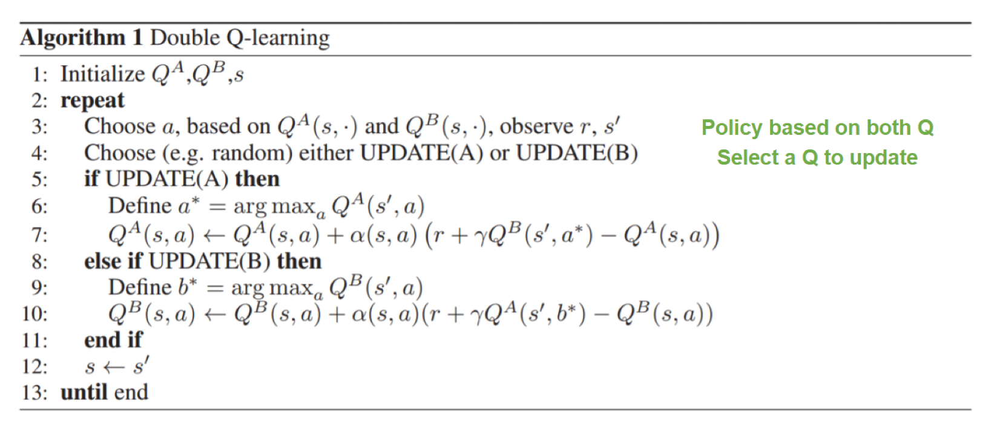

---
### DDQN

The DDQN modification to DQN makes use of the target network as the second network 

**Original DQN target**
$$ r + \gamma \underset{a}{\max} Q(s,a;\theta^{-}) $$

**DDQN target**
$$ r + \gamma Q(s', \underset{a}{argmax}Q(s',a; \theta); \theta^{-}) $$ 

- select the optimal action according to our online network
- but we use the Q value as estimated by the target network

---


---
## four
### eligibility traces
### prioritized experience replay
### DDQN
### Rainbow

---

TODO RAINBOW

---
## five <a id="section-five"></a>
### **motivations for policy gradients**
### introduction 
### the score function
### REINFORCE

---


---
### Policy gradients

Previously we looked at generating a policy from a value function 

$$ \underset{a}{argmax} Q(s,a) $$

In policy gradients we **parameterize a policy directly**

$$ \pi(a_t|s_t;\theta) $$

---
### John Schulan - Berkley, Open AI

<iframe width="560" height="315" src="https://www.youtube.com/embed/PtAIh9KSnjo?rel=0&amp;showinfo=0&amp;start=2905" frameborder="0" allow="autoplay; encrypted-media" allowfullscreen></iframe>

---
### Motivations for policy gradients

Stochastic policies

High dimensional or continuous action spaces

Optimize what we care about directly

Stability

---
### Motivation - stochastic policies


A determinstic policy (i.e. always rock) is eaisly exploited

A stochastic policy also gets us exploration built into the policy, that can be learned and controlled by the agent

---
### Motivation - high dimensional action spaces

Q-Learning requires a discrete action space to argmax across

Lets imagine controlling a robot arm in three dimensions in the range [0, 90] degrees

This corresponds to approx. 750,000 actions a Q-Learner would need to argmax across


---?image=assets/images/section5/disc_cont_act.png&size=auto 80%

### Motivation - optimize return directly

When learning value functions our optimizer is working towards improving the predictive accuracy of the value function

i.e. our gradients point in the direction of predicting return

This isn't what we really care about - we care about maximizing return

---
### Motivation - optimize return directly

Policy methods optimize return directly

Changing weights according to the gradient that maximizes future reward

Aligning gradients with our objective (and hopefully a business objective)

Can be easier to just select an action – rather than quantify return

---?image=assets/images/section5/motivation_simple.png&size=auto 80%

## five - policy gradients & Actor-Critic
### motivations for policy gradients
### introduction 
### the score function
### REINFORCE
### Actor-Critic

---
### Parameterizing policies

The type of policy you parameterize depends on the **action space**


---
### Parameterizing policies

The type of policy you parameterize depends on the **action space**


---
### Policy gradients without equations

We have a parameterized policy
- i.e. a neural network that outputs a distribution over actions

How do we improve it? (i.e. how do we learn?) 
- change parameters to take actions that get more reward
- change parameters to favour probable actions

Reward function is not known
- but we can calculate the *gradient of the expectation of reward*

---
### Policy gradients with a few equations

Imagine we have a policy $\pi(a_t|s_t;\theta)$, which is a **probability distribution over actions**

How do we improve it?  
- change parameters to take actions that get more reward
- change parameters to favour probable actions

Reward function is not known
- but we can calculate the *gradient of the expectation of reward*

$$\nabla_{\theta} \E[G_t] = \E[\nabla_{\theta} \log \pi(a|s) \cdot G_t]$$

Where does this strange equation come from?

---
### The score function in statistics

The **score function** comes from using the log-likelihood ratio trick

The score function allows us to get the gradient of a function by taking an expectattion

Expectataions are averages - meaning that we can use sample based methods to approximate them

$$\nabla_{\theta} \E[f(x)] = \E[\nabla_{\theta} \log P(x) \cdot f(x)]$$

---
### Deriving the score function

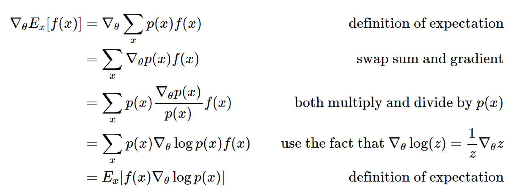

http://karpathy.github.io/2016/05/31/rl/

---
### The score function in reinforcement learning

$$\nabla_{\theta} \E[f(x)] = \E[\nabla_{\theta} \log P(x) \cdot f(x)]$$

$$\nabla_{\theta} \E[G_t] = \E_{\pi_{\theta}}[\nabla_{\theta} \log \pi(a_t|s_t;\theta) \cdot G_t]$$

The gradient of our return wrt our policy parameters = the expectation of the gradient of the policy wrt it's parameters * the return

The key here is that the RHS is an expectation.  We can estimate it by sampling

The expectation is made up of thing we can sample
- we can sample from our policy (i.e. we can get the probability of actions in certain states)
- we can sample the return (from experience)

---
### Training a policy

We use the score function to get the gradient, then follow the gradient 

gradient 

=

log(probability of action) * return

=

log(policy) * return

Note that the score function limits us to on-policy learning - we need to calculate the log probability of the action taken by the policy

--- 
### Policy gradient intuition

$$\E_{\pi_{\theta}}[\nabla_{\theta} \log \pi(a_t|s_t;\theta) \cdot G_t]$$

$\log \pi(a_t|s_t;\theta)$ - how probable was the action we picked

We want to reinforce actions we thought were good

$ G_t $ - how good was that action

We want to reinforce actions that were actually good

---
### REINFORCE 

We can use different methods to approximate the return $G_t$

One way is to use the Monte Carlo return - i.e. the true sampled discounted return.  This is known as REINFORCE

Using a Monte Carlo approach comes with all the problems we saw earlier
- high variance
- no online learning
- requires episodic environment

How can we get some the advantages of Temporal Difference methods?

---
### Baseline

We can introduce a baseline function - this reduces variance without introducing bias

$\log \pi(a_t|s_t;\theta) \cdot (G_t - B(s_t)$ - how probable was the action we picked

A natural baseline is the value function - which we parameterize using weights $w$.  This is known as REINFORCE with a baseline

$\log \pi(a_t|s_t;\theta) \cdot (G_t - B(s_t; w)$ - how probable was the action we picked

This also gives rise to the concept of **advantage**

$$A_{\pi}(s_t, a_t) = Q_{\pi}(s_t, a_t) - V_{\pi}(s_t)$$

The advantage function tells us how much better an action is than the average actionfor that policy & environment dynamics

---
### Actor-Critic


---
### Actor-Critic

Actor-Critic brings together value functions and policy gradients

We parameterize two functions
1. an **actor** = policy
2. a **critic** = value function

We update our actor (i.e. the behaviour policy) in the direction suggested by the critic

The direction is given by the temporal difference error

---


*Sutton & Barto*

---
### Actor-Critic Algorithm


---
### Determinstic Policy Gradient


---
### DPG

Actor Critic

Determinstic policy -> more efficient than stochastic (we only integrate over TODO)

Continuous action spaces

Off-policy learning

Uses experience replay

Uses target networks

---
### Stochastic vs determinstic policies

Stochastic policy is a probability distribution over actions

Actions are selected by sampling from this distribution

$$ \pi_{\theta}(a|s) = P[a|s,\theta] $$

DPG parameterizes a determinstic policy
$$a = \mu_{\theta}(s) $$

---
### DPG components

Actor
- off policy
- function that maps state to action
- exploratory

Critic
- on-policy
- critic of the current policy
- estimates $Q(s,a)$

---
### Gradients


Stochastic case integrates over both the state & action spaces

Deterministic case integrates over only the state space - leading to better sample efficiency

---
### Updating policy weights


---
### DPG results


The difference between stochastic (green) and deterministic (red) increases with the dimensionality of the action space


### A3C


---
### A3C

Asynchronous Advantage Actor-Critic 
- has obsoleted DQN as state of the art
- works in continuous action spaces

We saw earlier that experience replay is used to make learning more stable & decorrelate updates
- but can only be used with off-policy learners

---
### **Asynchronous** Advantage Actor-Critic 

Asynchronous
- multiple agents learning separately
- experience of each agent is independent of other agents
- learning in parallel stabilizes training

- allows use of on-policy learners

- runs on single multi-core CPU
- learns faster than many GPU methods

---
### Asynchronous **Advantage** Actor-Critic 

Advantage = the advantage function 

$$A_{\pi}(s_t, a_t) = Q_{\pi}(s_t, a_t) - V_{\pi}(s_t)$$

The advantage tells us how much better an action is than the average action followed by the policy

---
### A3C algorithm

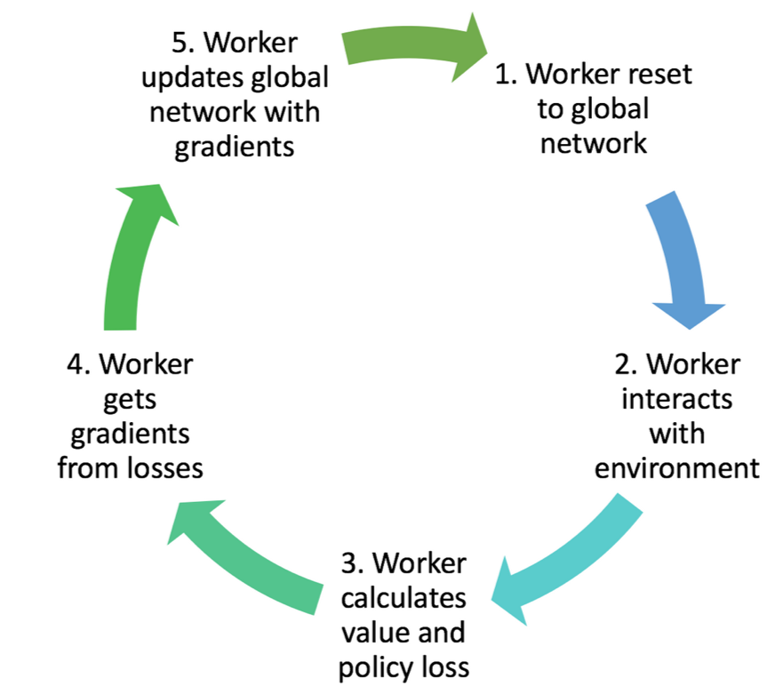

https://medium.com/emergent-future/simple-reinforcement-learning-with-tensorflow-part-8-asynchronous-actor-critic-agents-a3c-c88f72a5e9f2


### break
---
## six <a id="section-six"></a>
### AlphaGo
### AlphaGo Zero
### Residual networks

---
### AlphaGo


---
### AlphaGo Trailer

TODO

---
### IBM Deep Blue

First defeat of a world chess champion by a machine in 1997


---
### Deep Blue vs AlphaGo

Deep Blue was handcrafted
-  programmers & chess grandmasters

AlphaGo *learnt*
-  human moves & self play

AlphaGo evaluated fewer positions 
-  **width** policy network select states more intelligently
-  **depth** value function evaluate states more precisely

---
### Why Go?

Long held as the most challenging classic game for artificial intelligence
- massive search space
- more legal positions than atoms in universe
- difficult to evaluate positions & moves
- sparse & delayed reward

--- 
### Components of the AlphaGo agent

Three policy networks $\pi(s)$ 
- fast rollout policy network – linear function
- supervised learning policy – 13 layer convolutional NN
- reinforcement learning policy – 13 layer convolutional NN

One value function $V(s)$
- convolutional neural network

Combined together using Monte Carlo tree search

---
### Components of the AlphaGo agent

1. train fast & supervised policy networks
 predicting human moves

2. train reinforcement learning policy network
 initialize using supervised network weights
 self play (align gradient towards winning)

3. train value function
 use data generated during self play

---
### Learning

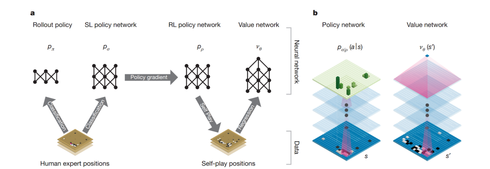

---
### Monte Carlo Tree Search

Value & policy networks combined using MCTS

Basic idea = analyse most promising next moves

Planning algorithm
- simulated (not actual experience)
- roll out to end of game (a simulated Monte Carlo return)

---
### Monte Carlo Tree Search

1. pick a state to investigate further
 using measures of state value & visit statistics

2. rollout down from this state
 use linear fast rollout policy

3. repeat

---
### Monte Carlo Tree Search


---
### Monte Carlo Tree Search in AlphaGo


---
### Monte Carlo Tree Search in AlphaGo


---
### Monte Carlo Tree Search in AlphaGo


---
### Monte Carlo Tree Search in AlphaGo

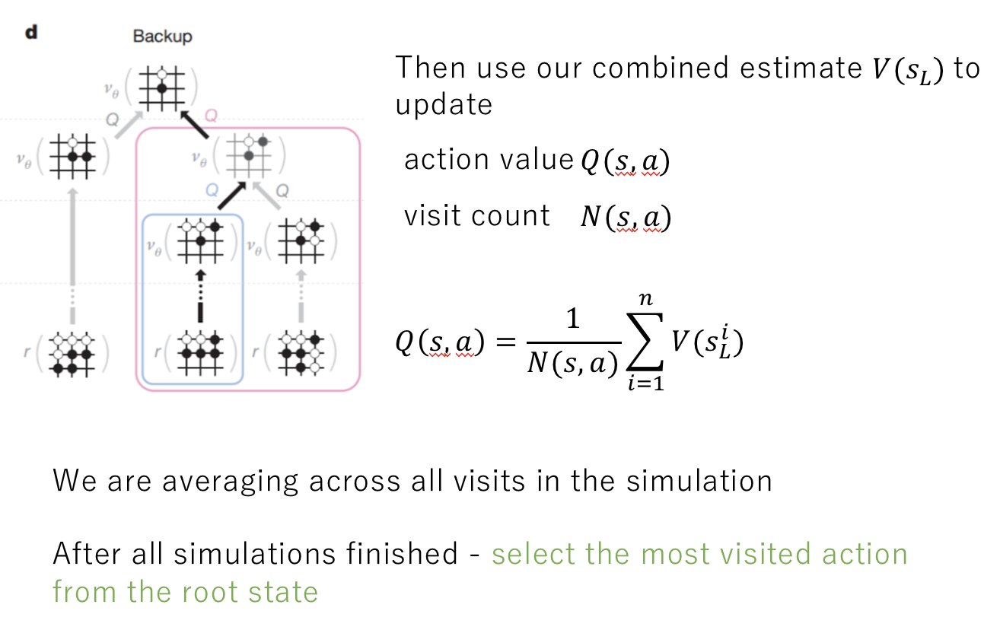

---
### AlphaGo, in context – Andrej Karpathy

Convenient properties of Go
- fully deterministic
- fully observed
- discrete action space
- access to perfect simulator
- relatively short episodes 
- evaluation is clear
- huge datasets of human play
- energy consumption (human ≈ 50 W) 1080 ti = 250 W

*https://medium.com/@karpathy/alphago-in-context-c47718cb95a5*

---
### AlphaGo Zero


---
### Key ideas in AlphaGo Zero

#### Simpler

#### Search

#### Adverserial

#### Machine knowledge only

--- 
### AlphaGo Zero Results

Training time & performance
- AG Lee trained over several months
- AG Zero beat AG Lee 100-0 after 72 hours of training

Computational efficiency
- AG Lee = distributed w/ 48 TPU
- AG Zero = single machine w/ 4 TPU

---
### AlphaGo Zero learning curve


---
### AlphaGo Zero learning curves

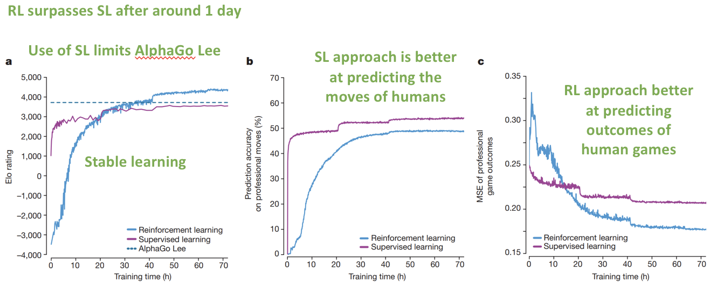

---
### AlphaGo Zero innovations

1. learns using only self play
- no learning from human expert games
- no feature engineering
- learn purely from board positions

2. single neural network
- combine the policy & value networks

3. MCTS only during acting (not during learning)

4. Use of residual networks developed for machine vision

---
### AlphaGo Zero acting & learning


---
### Search in AlphaGo Zero

**Policy evaluation**

Policy is evaluated through self play

This creates high quality training signals - the game result

**Policy improvement**

MCTS is used during acting to create the improved policy

The improved policy generated during acting becomes the target policy during training

[Keynote David Silver NIPS 2017 Deep Reinforcement Learning Symposium AlphaZero
](https://www.youtube.com/watch?v=A3ekFcZ3KNw)

---
### Residual networks


Convolutional network with skip connections

Layers are reformulated as residuals of the input

---
### Residual networks

Trying to learn $ H(x) $ 

Instead of learning $ F(x) = H(x) $ 

We learn the residual $ F(x) = H(x) - x $ 

And can get $ H(x) = F(x) + x $ 


---
### DeepMind AlphaGo AMA


---
### DeepMind AlphaGo AMA


---
### break
---
## seven <a id="section-seven"></a>
### practical concerns

---
### Key Questions

What is the action space
- what can the agent choose to do
- does the action change the environment
- continuous or discrete

What is the reward

It is a complex problem
- classical optimization techniques such as linear programming or cross entropy may offer a simpler solution

---
### Preprocessing

As with supervised learning, scaling/processing of inputs and targets for neural networks is key to keep gradients under control

In reinforcement learning we often don't know the true min/max/mean/standard deviation of observations/actions/rewards/returns

DQN clips rewards to the range $[-1, +1]$

More complex methods adapatively normalize targets using statistics collected from history

---
### Mistakes I've made so far

Normalizing targets - a high initial target that occurs due to the initial weights can skew the normalization for the entire experiment

Doing multiple epochs over a batch

Not keeping batch size the same for experience replay & training

Not setting `next_observation = observation`

Not setting online & target network variables the same at the start of an experiment

---
### Mistakes DSR students have made in RL projects

Since I started teaching in Batch 10 we have had three RL projects

Saving agent brain 
- not saving the optimizer state

Using too high a learning rate 
- learning rate is always important!!!

---
### Hyperparameters

**Policy gradients**
- learning rate
- clipping of distribution parameters (stochastic PG)
- noise for exploration (deterministic PG)
- network structure

**Value function methods**
- learning rate
- exploration (i.e. epsilon)
- updating target network frequency
- batch size
- space discretization

---


[John Schulman – Berkley Deep RL Bootcamp 2017](https://www.youtube.com/watch?v=8EcdaCk9KaQ)

---
### John Schulman advice

Quick experiments on small test problems

Interpret & visualize learning process
- state visitation, value functions

Make it easier to get learning to happen (initially)
- input features, reward function design

Always use multiple random seeds

---
### John Schulman advice

Standardize data
- if observations in unknown range, estimate running average mean & stdev

Rescale rewards - but don’t shift mean

Standardize prediction targets (i.e. value functions) the same way

---
### John Schulman advice

Batch size matters

Policy gradient methods – weight initialization matters
determines initial state visitation (i.e. exploration)

DQN converges slowly

---


https://www.quora.com/How-can-I-test-if-the-training-process-of-a-reinforcement-learning-algorithm-work-correctly

---
### Gary Wang advice

Debugging RL algorithms is very hard. Everything runs and you are not sure where the problem is.

Simple environments for testing
- CartPole for discrete action spaces
- Pendulum for continuous action spaces

Be careful not to overfit these simple problems

Rescale environment observations if they have known mins & maxs

Rescale/clip reward if very large

Compute useful statistics 
- explained variance (for seeing if your value functions are overfitting), 
- computing KL divergence of policy before and after update (a spike in KL usually means degradation of policy)
- entropy of your policy

Visualize statistics
- running min, mean, max of episode returns
- KL of policy update
- explained variance of value function fitting
- network gradients

Gradient clipping is helpful - dropout & batchnorm not so much

Simple neural networks

Multiple random seeds

Automate experiments - don't waste time watching them run!

Spend time looking at open source RL packages

---
### Cool open source RL projects

[gym](https://github.com/openai/gym/tree/master/gym) - Open AI

[baselines](https://github.com/openai/baselines) - Open AI

[rllab](https://github.com/rll/rllab) - Berkley

[Tensorforce](https://github.com/reinforceio/tensorforce) - reinforce.io

There are so many more!
---
## eight <a id="section-eight"></a>
### beyond the expectation

---


---
### Beyond the expectation

All the reinforcement learning today we have seen is about the expectation (mean expected return)

$$Q(s,a) = \mathfb{E}[G_t] = \mathfb{E}[r + \gamma Q(s',a)] $$

In 2017 DeepMind introduced the idea of the value distribution

State of the art results on Atari

---
### Beyond the expectation


The expected value of 7.5 minutes will never occur in reality!

---


*Bellamare et. al 2017*

---


*Bellamare et. al 2017*

---


*https://www.youtube.com/watch?v=mckulxKWyoc*

---

### TODO MORE ON THIS 

---


---


---


*Chelsea Finn – Berkley Deep RL Bootcamp 2017*

---


*Chelsea Finn – Berkley Deep RL Bootcamp 2017*

---


## thank you

Adam Green

adgefficency.com

adam.green@adgefficiency.com
