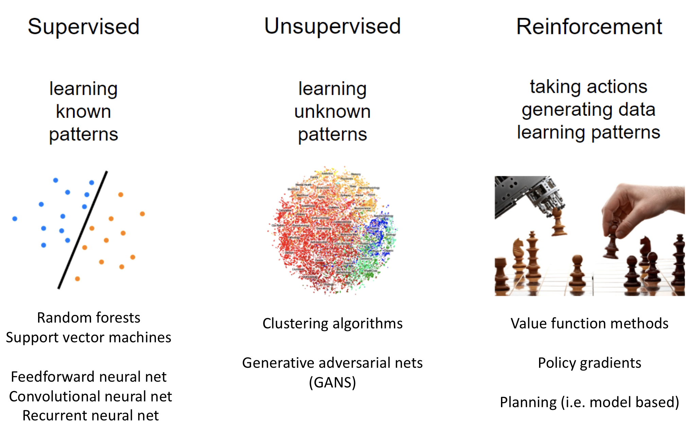
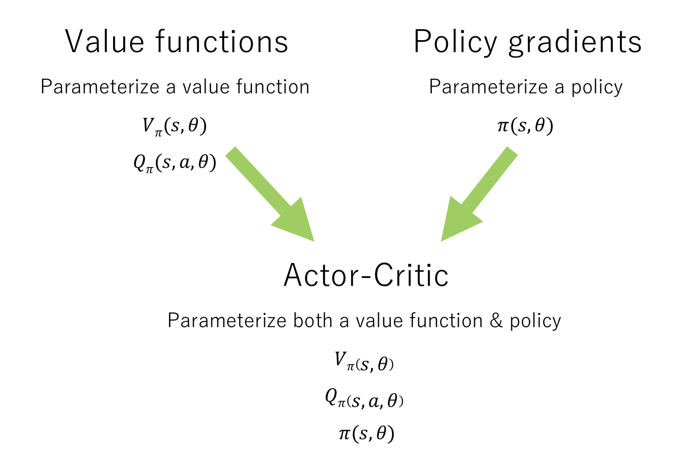
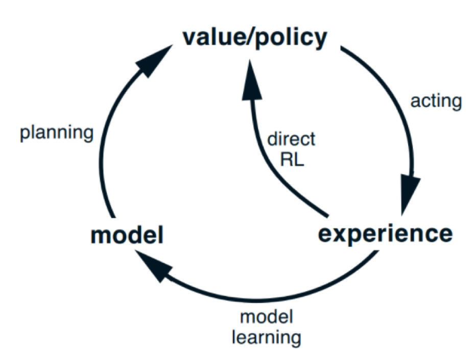

## introduction to reinforcement learning

### Related methods 

**Evolutionary methods** 
- better able to deal with sparse error signals 
- easily parallelizable
- tend to perform better that RL if state variable is hidden

**Cross entropy method** is often recommended as an alternative 

Constrained optimization such as **linear programming** 

Any other **domain specific** algorithm for your problem

### Machine learning



###  Reinforcement learning is not

NOT an alternative method to use instead of a random forest, neural network etc

“I’ll try to solve this problem using a convolutional nn or RL” **this is nonsensical**

Neural networks (supervised techniques in general) are a tool that reinforcement learners can use to learn or approximate functions
- classifier learns the function of image -> cat
- regressor learns the function of market_data -> stock_price

###  Deep reinforcement learning

**Deep learning** 
- neural networks with multiple layers

**Deep reinforcement learning** 
- using multiple layer networks to approximate policies or value functions
- feedforward 
- convolutional 
- recurrent 

### Model free reinforcement learning



###  Applications

RL is **decision making**


[*David Silver – Deep Reinforcement Learning*](http://www0.cs.ucl.ac.uk/staff/d.silver/web/Resources_files/deep_rl.pdf)

###  Biological inspiration

Sutton & Barto - Reinforcement Learning: An Introduction
>Of all the forms of machine learning, reinforcement learning is the closest to the kind of learning that humans and other animals do, and many of the core algorithms of reinforcement learning were originally inspired by biological learning systems 

Mnih et. al (2015) Human-level control through deep reinforcement learning
>Neurobiological evidence that reward signals during perceptual learning may influence the characteristics of representations within the primate visual cortex 

### Habit formation

Cue -> Routine -> Reward

State -> Action -> Reward


###  A new level of intelligence

Founder & CEO of DeepMind Demis Hassabis on the brilliance of AlphaGo in it's 2015 series

<iframe width="854" height="480" src="https://www.youtube.com/embed/i3lEG6aRGm8?start=1632" frameborder="0" allow="autoplay; encrypted-media" allowfullscreen></iframe>

### Reinforcement Learning

### is

### learning through action


### Contrast with supervised learning 

Supervised learning
- are given a dataset with labels
- we are constrained by this dataset
- test on unseen data

Reinforcement learning 
- are given no dataset and no labels
- we can generate more data by acting
- test using the same environment

Data in RL
- the agent's experience $(s,a,r,s')$
- it's not clear what we should do with this data 
- no implicit target

### Reinforcement learning dataset

The dataset we generate is the agent's memory

$$[experience,$$
$$experience,$$
$$...$$
$$experience]$$

$$[(s\_{0}, a_0, r_1, s_1), $$ 
$$(s_1, a_1, r_2, s_2), $$
$$...$$
$$(s_n, a_n, r_n, s_n)] $$

What should we do with this dataset?

## Markov Decision Processes

Mathematical framework for reinforcement learning 

### Markov property

Can be a requirement to gurantee convergence

Future is conditional only on the present

Can make prediction or decisions using only the current state

Any additional information about the history of the process will not improve our decision

$$ P(s\_{t+1} | s\_{t}, a\_{t}) = P(s\_{t+1}|s\_t,a\_t...s\_0,a\_0)$$

### Formal definition of a MDP

An MDP can be defined a tuple

$$ (\mathcal{S}, \mathcal{A}, \mathcal{R}, P, R, d_0, \gamma) $$

Set of states $\mathcal{S}$

Set of actions $\mathcal{A}$

Set of rewards $\mathcal{R}$

State transition function $ P(s'|s,a) $

Reward transition function $ R(r|s,a,s') $  

Distribution over initial states $d_0$

Discount factor $\gamma$

### Object oriented definition of a MDP

Two objects - the agent and environment

Three signals - state, action & reward

`class Agent`

`class Environment`

`state = env.reset()`

`action = agent.act(state)`

`reward, next_state = env.step(action)`

### Environment

Real or virtual 
- modern RL uses virtual environments to generate lots of experience

Each environment has a state space and an action space
- these spaces can be discrete or continuous

Environments can be 
- episodic (finite length, can be variable or fixed length)
- non-episodic (infinite length)

The MDP framework unites both in the same way by using the idea of a final absorbing state at the end of episodes

### Discretiziation

Too coarse 
- non-smooth control output

Too fine 
- curse of dimensionality 
- computational expense

Requires some prior knowledge

Lose the shape of the space

### State

Infomation for the agent to **choose next action** and to **learn from**

State is a flexible concept - it's a n-d array

`state = np.array([temperature, pressure])`

`state = np.array(pixels).reshape(height, width)`

### Observation

Many problems your agent won't be able to see everything that would help it learn - i.e. non-Markov

This then becomes a POMDP - partially observed MDP

``` python
state = np.array([temperature, pressure])

observation = np.array([temperature + noise])
```
Observation can be made more Markov by
- concatenating state trajectories together
- using function approximation with a memory element (LSTMs)

### Agent

Our agent is the **learner and decision maker**

It's goal is to maximize total discounted reward

An agent always has a policy 

<br></br>

### Reward

Scalar

Delayed

Sparse

A well defined reward signal is a limit for applying RL 

### Reward hypothesis

Maximising expected return is making an assumption about the nature of our goals

*Goals can be described by the maximization of expected cumulative reward*

Do you agree with this?
- happiness
- status
- reputation

Think about the role of emotion in human decision making.  Is there a place for this in RL?

### Reward engineering


[Reinforcement Learning and the Reward Engineering Principle](http://www.danieldewey.net/reward-engineering-principle.pdf)

### Policy $\pi(s)$

$$\pi(s)$$

$$\pi(s,a|\theta)$$

$$\pi_\theta(s|a)$$

A policy is rules to select actions
- act randomly
- always pick a specific action
- the optimal policy - the policy that maximizes future reward

Policy can be
- parameterized directly (policy gradient methods)
- generated from a value function (value function methods)

Deterministic or stochastic

### Prediction versus control

Prediction / approximation
- predicting return for given policy

Control 
- the optimal policy
- the policy that maximizes expected future discounted reward


### On versus off policy learning

On policy 
- learn about the policy we are using to make decisions 

Off policy 
- evaluate or improve one policy while using another to make decisions

Control can be on or off policy 
- use general policy iteration to improve a policy using an on-policy approximation

### Why would we want to learn off-policy?

We can learn about policies that we don't have
- learn the optimal policy from data generated by a random policy

We can reuse data
- on-policy algorithms have to throw away experience after the policy is improved

> Maybe the less we need to learn from deep learning is large capacity learners with large and diverse datasets - Sergey Levine


### Environment model

Our agent can learn an environment model

Predicts environment response to actions
- predicts $s', r$ from $s, a$

```python
def model(state, action):

    # do stuff

    return next_state, reward
```

Sample vs. distributional model

Model can be used to simulate trajectories for **planning**




*Sutton & Barto - Reinforcement Learning: An Introduction*


### Return

Goal of our agent is to maximize reward

Return ($G_t$) is the total discounted future reward

$$G\_t = r\_{t+1} + \gamma r\_{t+2} + \gamma^2 r\_{t+3} + ... = \sum\_{k=0}^{\infty} \gamma^k r\_{t+k+1}$$

` reward + discount * reward + discount^2 * reward ...`

**Why do we discount future rewards?**

### Discounting

Future is uncertain 
- stochastic environment

Matches human thinking 
- hyperbolic discounting

Finance 
- time value of money

Makes the maths works
- return for infinite horizon problems finite
- discount rate is $[0,1)$ 
- can make the sum of an infinite series finite 
- geometric series

### Discounting

Can use discount = 1 for
- games with tree-like structures (without cycles)
- when time to solve is irrelevant (i.e. a board game)

## Four central challenges 

one - exploration vs exploitation

two - data quality

three - credit assignment

four - sample efficiency

### Exploration vs exploitation
Do I go to the restaurant in Berlin I think is best – or do  I try something new?

- exploration = finding information
- exploitation = using information

Agent needs to balance between the two
- we don't want to waste time exploring poor quality states
- we don't want to miss high quality states

### Exploration vs exploitation

How stationary are the environment state transition and reward functions?  

How stochastic is my policy?

Design of reward signal vs. exploration required

Time step matters
- too small = rewards are delayed = credit assignment harder
- too large = coarser control 

### Data quality

iid = independent sampling & identical distribution

RL breaks both in multiple ways

**Independent sampling**
- all the samples collected on a given episode are correlated (along the state trajectory)
- our agent will likely be following a policy that is biased (towards good states)

**Identically distributed**
- learning changes the data distribution
- exploration changes the data distribution 
- environment can be non-stationary

## Reinforcement learning will **always** break supervised learning assumptions about data quality

###  Credit assignment

The reward we see now might not be because of the action we just took

Reward signal can be 
- **delayed** - benefit/penalty of action only seen much later  
- **sparse** - experience with reward = 0

Can design a more dense reward signal for a given environment
- reward shaping
- changing the reward signal can change behaviour

### Sample efficiency
How quickly a learner learns

How often we reuse data
- do we only learn once or can we learn from it again
- can we learn off-policy

How much we squeeze out of data
- i.e. learn a value function, learn a environment model

Requirement for sample efficiency depends on how expensive it is to generate data
- cheap data -> less requirement for data efficiency
- expensive / limited data -> squeeze more out of data

### Four challenges
**exploration vs exploitation**

how good is my understanding of the range of options

**data**

biased sampling, non-stationary distribution

**credit assignment**

which action gave me this reward

**sample efficiency**

learning quickly, squeezing information from data
