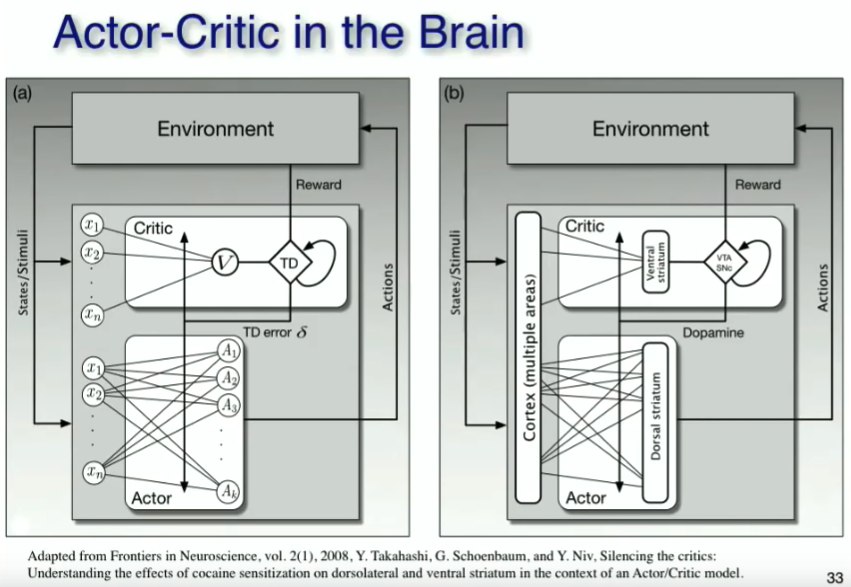
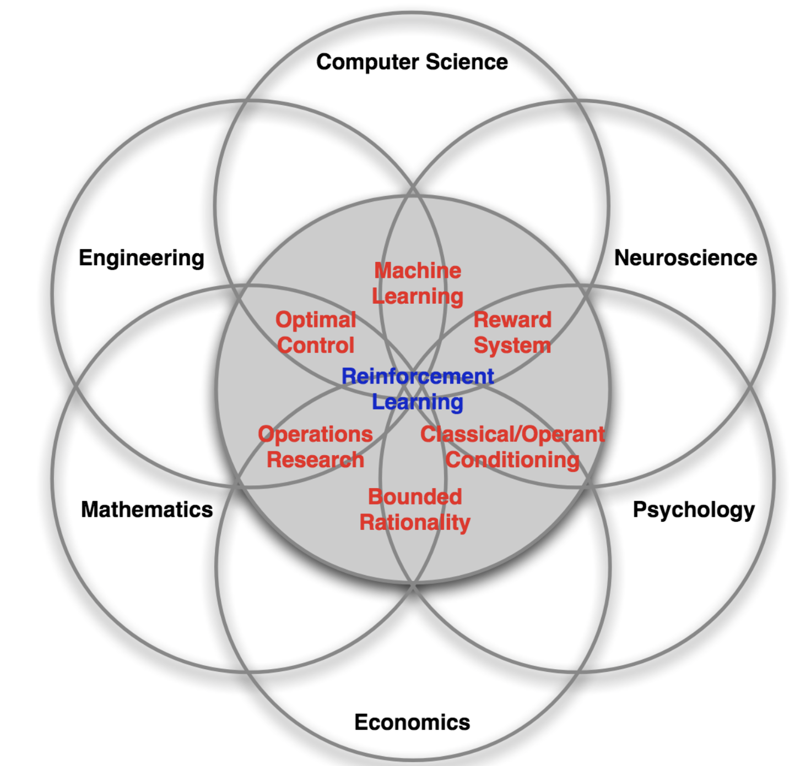
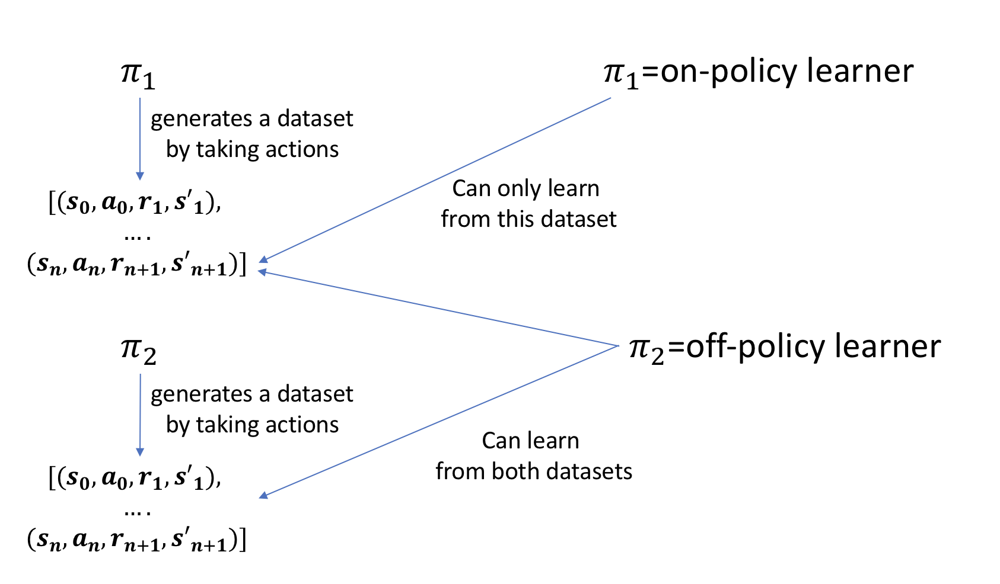

# Two - Introduction to Reinforcement Learning

Context, the Markov Decision and four central challenges in reinforcement learning.

---

## What is reinforcement learning

The goal in reinforcement learning is to develop agents that can learn to take actions that maximize a scalar reward signal.  Reinforcement learning is fundamentally about **decision making**

> Goal at DeepMind is to try to use reinforcement learning to solve some of the bigger visions of AI ... it is the paradigm of artificial intelligence ... RL is the paradigm that describes how to learn optimal decisions in any environment - [David Silver](https://www.youtube.com/watch?v=M5a6HasTHs4)

Reinforcement learning is all about **decision making**.  Internally, agents are involved in **data generation** and **target generation**.  There are multiple moving parts in an agent (often supervised learning makes up some of these parts).

##  Biological inspiration

The reinforcement learning approach is one that is familiar to any human being.  It is learning through action.

To learn chess in a supervised manner, we would learn moves from textbooks of the games of grandmasters.

To learn chess in a reinforcement learning manner, we would learn chess by playing ourselves.

> Of all the forms of machine learning, reinforcement learning is the closest to the kind of learning that humans and other animals do, and many of the core algorithms of reinforcement learning were originally inspired by biological learning systems - Sutton & Barto - Reinforcement Learning: An Introduction

> Neurobiological evidence that reward signals during perceptual learning may influence the characteristics of representations within the primate visual cortex - Mnih et. al (2015) Human-level control through deep reinforcement learning

### Habit formation

The mechanism by which habits are formed is essentially the reinforcement learning mechanism

Cue -> Routine -> Reward

State -> Action -> Reward

Variable rewards

- dopamine surges when brain is expecting a reward
- variability multiplies the effect
- focused state where judgment and reason are suppressed

### Schultz 1990 experiments

**Dopamine** - connection between TD error and dopamine in the brain.  Dopamine signal can be modelled as a TD error.  Phasic activity of dopamine is trigged by a reward.  With continued trials, the dopamine signal moves back towards the time of the prediction (which is the same that the TD error does - a  backup). (https://www.youtube.com/watch?v=ul6B2oFPNDM)

The phasic activity of mesencephalic dopamine neurons signals the error between and old and new estimate of expected future reward

{ width=50%, height=50% }

## Applications

David Silver gives the following

- control physical systems
- interact with users - customer retention, personalization
- solve logistical problems - scheduling, bandwidth allocation, power optimization
- play games
- learn sequential algorithms - attention, memory, conditional computation, activations

\newpage

## Related methods 

{ width=35%, height=35% }

**Evolutionary methods** - [wikipedia](https://en.wikipedia.org/wiki/Evolutionary_algorithm)

- use biological inspired mechanisms such as reproduction, mutation and selection
- better able to deal with sparse error signals 
- easily parallelizable
- tend to perform better that RL if state variable is hidden
- CMA-ES works well for solution spaces up to a few thousand parameters

**Cross entropy method**  [wikipedia](https://en.wikipedia.org/wiki/Cross-entropy_method)

- often recommended as an alternative 
- generate a random sampling of data (i.e. an episode)
- update parameters of the model to produce a better sample in the next iteration
- this involves minimizing the KL-divergence

**Linear programming** [wikipedia](https://en.wikipedia.org/wiki/Linear_programming)

- constrained optimization
- environment model must be linear

**Optimal control** [wikipedia](https://en.wikipedia.org/wiki/Optimal_control) - [Data-Driven control lecture](https://www.youtube.com/watch?v=oulLR06lj_E)

- primarily concerned with control of linear systems
- commonly used in electrical engineering

A **domain specific** algorithm for your problem - if you have one, use it!

\newpage

## Context within machine learning


### Supervised learning 

Feedback is the target (one per sample).

- are given a dataset with labels
- we are constrained by this dataset
- test on unseen data

|features|target|
|---|---|
|$(2.0, 1.5)$| $25$ |
|$(1.2, 0.3)$| $7.2$|

### Unsupervised learning 

Feedback from data structures, adversarial training.

|features|
|---|
|$(2.0, 1.5)$|
|$(1.2, 0.3)$|

### Reinforcement learning 

Feedback from state transitions and a scalar reward signal.

- are given no dataset and no labels
- we can generate more data by acting
- test using the same environment

Reinforcement learning has more to do that supervised learning.  In reinforcement learning we need to **generate our own data**.  The data we generate is experience tuples $(s,a,r,s')$, which are sampled from the environment by taking actions.  How we generate that data (i.e. what actions we take) is up to the agent.

Once we store a list of these experience tuples in our agents memory, we then need to learn.  In supervised learning all our samples have targets (i.e. the class of that sample).  The reinforcement learning dataset is just a list of tuples!

This is the second task that agents need to do - **label their experience**.  Once the experience is labelled, supervised learning techniques (such as stochastic gradient descent) can be used to fit a function that predicts the target.  Reinforcement learning uses supervised learning as a tool to learn functions.

$$[experience, experience, ..., experience]$$

$$[(s_0, a_0, r_1, s_1), (s_1, a_1, r_2, s_2), ..., (s_n, a_n, r_n, s_n)] $$

Success in modern reinforcement learning (2013 onwards) is in part due to making use of advances in supervised learning (deep neural networks) to better approximate functions the agent chooses to learn.

### Reinforcement learning is not

NOT an alternative method to use instead of a random forest, neural network etc.  “I’ll try to solve this problem using a convolutional nn or RL” **this is nonsensical**.

Neural networks (supervised techniques in general) are a tool that reinforcement learners can use to learn or approximate functions

- classifier learns the function of image -> cat
- regressor learns the function of market_data -> stock_price

In reinforcement learning a common function we want to learn is a policy - a function of state -> action.  Another is a value function, which maps state -> return.

### Deep reinforcement learning

**Deep learning** = neural networks with multiple layers

**Deep reinforcement learning** = using multiple layer networks to approximate policies or value functions

- feedforward 
- convolutional 
- recurrent 

\newpage

### Model free reinforcement learning

{ width=30%, height=30% }

\newpage

## Markov Decision Processes

The mathematical framework for reinforcement learning.

{ width=40%, height=40% }

{ width=40%, height=40% }

### Markov property

Can be a requirement to guarantee convergence

Future is conditional only on the present

Can make prediction or decisions using only the current state

Any additional information about the history of the process will not improve our decision

$$ P(s\_{t+1} | s\_{t}, a\_{t}) = P(s\_{t+1}|s\_t,a\_t...s\_0,a\_0)$$

### Formal definition of a MDP

An MDP can be defined as a tuple

$$(\mathcal{S}, \mathcal{A}, \mathcal{R}, P, R, d_0, \gamma)$$

Set of states $\mathcal{S}$

Set of actions $\mathcal{A}$

Set of rewards $\mathcal{R}$

State transition function $P(s'|s,a)$

Reward transition function $R(r|s,a,s')$

Distribution over initial states $d_0$

Discount factor $\gamma$

## Object oriented definition of a MDP

Two objects - the agent and environment

Three signals - state, action & reward

```python
class Agent

class Environment

state = env.reset()

action = agent.act(state)

reward, next_state = env.step(action)
```

### Environment

Real or virtual 

- modern RL uses virtual environments to generate lots of experience

Each environment has a state space and an action space

- these spaces can be discrete or continuous

Environments can be 

- episodic (finite length, can be variable or fixed length)
- non-episodic (infinite length)

The MDP framework unites both in the same way by using the idea of a final absorbing state at the end of episodes

Discretiziation 

- some agents require discrete spaces (i.e. Q-Learning requires a discrete action space)
- too coarse -> non-smooth control output
- too fine -> curse of dimensionality & computational expense
- requires some prior knowledge
- lose the shape of the space

Losing the shape of the space = agent sees all actions as discrete options, and has no way to understand the relationship between each one (this is true for the DQN style neural network, with one output node per action).

### State

Infomation for the agent to **choose next action** and to **learn from**

State is a flexible concept - it's a n-d array

```python
state = np.array([temperature, pressure])

state = np.array(pixels).reshape(height, width)
```

Make sure all the info you need to learn & make good decisions is in the state!

### Observation

Many problems your agent won't be able to see everything that would help it learn - i.e. non-Markov

This then becomes a POMDP - partially observed MDP

``` python
state = np.array([temperature, pressure])

observation = np.array([temperature + noise])
```
Observation can be made more Markov by
- concatenating state trajectories together
- using function approximation with a memory element (LSTMs)

### Agent

Our agent is the **learner and decision maker**

It's goal is to maximize total discounted reward

An agent always has a policy 

### Reward

The reward is a scalar signal sent at each step (it can be zero).  The reward for an action can often be **delayed** - making assigning credit to the correct action difficult.

The reward signal can also be **sparse** - the most extreme cases being environments where all rewards are zero except the terminal state (such as Go or Chess).

A well defined reward signal is a limit for applying reinforcement learning.  Autonomous driving is a good example - the reward function for driving has to be designed to balance safety, speed etc.

> The Reward Engineering Principle = As reinforcement learning based AI systems become more general and more autonomous, the design of reward mechanisms that elicit desired behaviours becomes both more important and more difficult - [Reinforcement Learning and the Reward Engineering Principle](http://www.danieldewey.net/reward-engineering-principle.pdf){ width=50%, height=50% }

Maximising expected return is also making an assumption about the nature of our goals

*Goals can be described by the maximization of expected cumulative reward* - do you agree with this?  Think about

- happiness
- status
- reputation

Think about the role of emotion in human decision making.  Is there a place for this in reinforcement learning

### Policy $\pi(s)$

$$\pi(s)$$
$$\pi(s,a|\theta)$$
$$\pi_\theta(s|a)$$

A policy is

- rules to select actions (in this state, go left etc)
- a function that maps state -> action
- a probability distribution over actions

Some example policies are

- always act randomly
- always pick a specific action
- the optimal policy - the policy that maximizes future reward

Policies can be parameterized directly (policy gradient methods)
or generated from a value function (value function methods).  They can also be either deterministic or stochastic.

### On versus off policy learning

On policy - learn about the policy we are using to make decisions 

Off policy - evaluate or improve one policy while using another to make decisions

Control can be on or off policy - use general policy iteration to improve a policy using an on-policy approximation.  On to off-policyness is a scale (agents vary in degrees).

> Maybe the less we need to learn from deep learning is large capacity learners with large and diverse datasets - Sergey Levine

Why would we want to learn off-policy?

- we can learn about policies that we don't have
- learn the optimal policy from data generated by a random policy
- we can reuse data
- on-policy algorithms have to throw away experience after the policy is improved

Learning from diverse datasets = requires off-policy learning.

{ width=40%, height=40% }

Remember that as soon as the weights of any neural networks used by the agent changes, the policy changes.  On-policy agents must throw away experience after they have improved the policy.

An off-policy agent can reuse experience multiple times - is able to use experience generated by a poor quality policy being followed for exploration early on in an agent's life.

## Environment model

Environment models predict the response (i.e. next state and reward) of an environment for a given state and action.

$$ P(s',r | s, a) $$

Our agent can learn an environment model - predicts environment response to actions
- predicts $s', r$ from $s, a$

```python
def model(state, action):
    # do stuff
    return next_state, reward
```

Sample vs. distributional model

- sample can be easy to build (i.e. two random number generators for rolling dice)
- distributional requires understanding the probability distribution over all possible next states and rewards

Model can be used to simulate trajectories for **planning**.  Planning is really important in our own thinking, and is very powerful if you can get it to work.

A good environment model is very valuable - it allows planning.  Planning is the simulation of rollouts - the agent can use the results of these rollouts to decide what action to take or to improve learning.

A key challenge in model based reinforcement learning is to learn the model. If a good model can be learnt then it's likely to be very valuable.  Dynamic programming (which is introduced in Section 3) uses an environment model to perfectly solve environments.

{ width=30%, height=30% }

\newpage

{ width=50%, height=50% }

\newpage

## Return

Goal of our agent is to maximize total reward - not just the next step but.  Return ($G_t$) is the total discounted future reward

$$ G_t = r_{t+1} + \gamma r_{t+2} + \gamma^2 r_{t+3} + ... = \sum_{k=0}^{\infty} \gamma^k r_{t+k+1} $$

The discount factor is exponential (usually set around 1.0 - 0.9) - rewards in the future become much less valuable than reward sooner.

### Why discount 

Future is uncertain = stochastic environment (or maybe even a stochastic policy!).

Matches human thinking - we use hyperbolic discounting in our decision making.  Our discount rates are also variable (based on environmentalstimulus).

Finance = time value of money.  Money is more valuable today than in a years time because I can invest that money today and earn one years interest on it.

Makes the maths work = the discount rate allows the finite and infinite horizion problems to be united in the same framework.

- return for infinite horizon problems finite
- discount rate is $[0,1)$ 
- can make the sum of an infinite series finite 
- this is a geometric series

Can use discount = 1 for games with tree-like structures (without cycles), or when time to solve is irrelevant (i.e. a board game).

\newpage

## Four central challenges 

### Exploration vs exploitation
Do I go to the restaurant in Berlin I think is best – or do  I try something new?

- exploration = finding information
- exploitation = using information

Agent needs to balance between the two

- we don't want to waste time exploring poor quality states
- we don't want to miss high quality states

How stationary are the environment state transition and reward functions?  
How stochastic is my policy?

Design of reward signal vs. exploration required

Time step matters

- too small = rewards are delayed = credit assignment harder
- too large = coarser control 

### Data quality

IID = independent sampling & identical distribution

RL breaks both in multiple ways

**Independent sampling**
- all the samples collected on a given episode are correlated (along the state trajectory)
- our agent will likely be following a policy that is biased (towards good states)

**Identically distributed**
- learning changes the data distribution
- exploration changes the data distribution 
- environment can be non-stationary

Reinforcement learning will **always** break supervised learning assumptions about data quality

### Credit assignment

The reward we see now might not be because of the action we just took

Reward signal can be 
- **delayed** - benefit/penalty of action only seen much later  
- **sparse** - experience with reward = 0

Can design a more dense reward signal for a given environment
- reward shaping
- changing the reward signal can change behaviour

### Sample efficiency
How quickly a learner learns

How often we reuse data
- do we only learn once or can we learn from it again
- can we learn off-policy

How much we squeeze out of data
- i.e. learn a value function, learn a environment model

Requirement for sample efficiency depends on how expensive it is to generate data
- cheap data -> less requirement for data efficiency
- expensive / limited data -> squeeze more out of data

