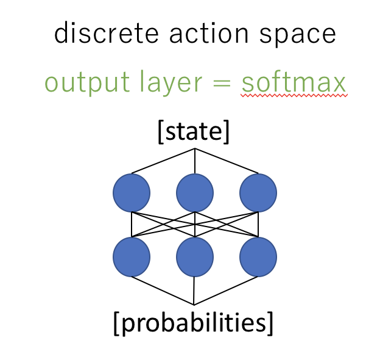
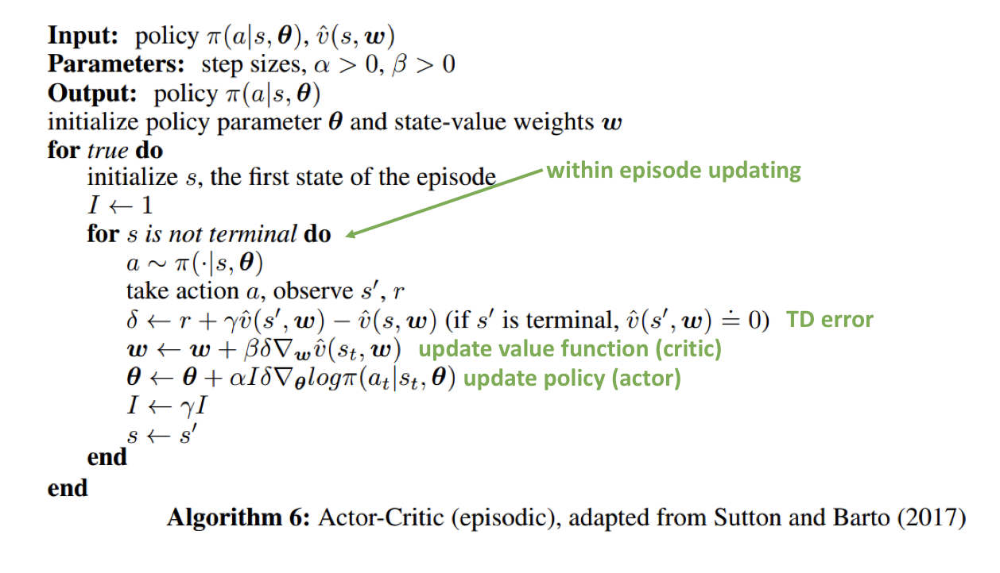
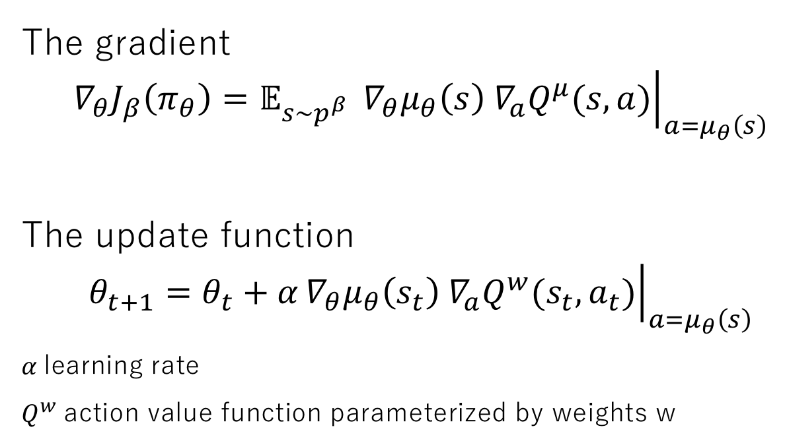

# Five - Policy Gradients

Motivations for using policies, how to use a policy, the score function, Actor-Critic, DPG, PPO.

---

## Contrast with value function methods

Previously we generated a policy from a value function.

$$ a = \underset{a}{argmax} Q(s,a) $$

In policy gradients we **parameterize a policy directly**.  This policy is a probability distribution over actions.

$$ a \sim \pi(a_t|s_t;\theta) $$

## Motivations for policy gradients

### Stochastic policies

{ width=30%, height=30% }

A stochastic policy means exploration is built into the policy -> exploration can be controlled by the agent by changing parameters.  A common example of this is for the agent to be able to learn the standard deviation of an action.

### High dimensional action spaces

Q-Learning requires a discrete action space to $argmax$ across

Lets imagine controlling a robot arm in three dimensions in the range [0, 90] degrees

This corresponds to approx. 750,000 actions a Q-Learner would need to argmax across

We also lose shape of the action space by discretization.  By this I mean that the agent now has an action space of discrete actions with no understanding of how they relate to each other

{ width=80%, height=80% }

### Optimize return directly

When learning value functions our optimizer is working towards improving the predictive accuracy of the value function
- our gradients point in the direction of predicting return

This isn't what we really care about - we care about maximizing return

Policy methods optimize return directly
- changing weights according to the gradient that maximizes future reward
- aligning gradients with our objective (and hopefully a business objective)

### Simplicity

Learning a value function and deriving a policy from it is more complex than simply parameteterizing a policy.  Some states don't require exact quantification of return for each action - it's very obvious what is the correct action.  An example of this is TODO

Policy gradients are more general and versatile

More compatible with recurrent neural networks.  Policy gradient methods are often trained using sequences of experience.

## Policy gradients versus value functions

**Policy gradients**

- optimize return directly
- work in continuous and discrete action spaces
- works better in high-dimensional action spaces

**Value functions**

- optimize value function accuracy
- off policy learning
- exploration
- better sample efficiency

{ width=30%, height=30% }

## Parameterizing policies

The type of policy you parameterize depends on the **action space**

{ width=30%, height=30% }

{ width=30%, height=30% }

## Policy gradients without equations

We have a parameterized policy

- a neural network that outputs a distribution over actions

How do we improve it - how do we learn?

- change parameters to take actions that get more reward
- change parameters to favour probable actions

Reward function is not known

- but we can calculate the *gradient the expected reward*

## Policy gradients with a few equations

Our policy $\pi(a_t|s_t;\theta)$ is a **probability distribution over actions**

How do we improve it?  

- change parameters to take actions that get more reward
- change parameters to favour probable actions

Reward function is not known
- but we can calculate the *gradient of the expectation of reward*

$$\nabla\_{\theta} \mathbf{E}[G\_t] = \mathbf{E}[\nabla\_{\theta} \log \pi(a|s) \cdot G\_t]$$

We can figure out how to change our parameters without actually knowing the reward function itself

## The score function in statistics

The **score function** comes from using the log-likelihood ratio trick

The score function allows us to get the gradient of a function by **taking an expectation**

Expectataions are averages 
- use sample based methods to approximate them

$$\nabla_{\theta} \mathbf{E}[f(x)] = \mathbf{E}[\nabla_{\theta} \log P(x) \cdot f(x)]$$

](../../assets/images/section_5/score_derivation.png){ width=30%, height=30% }

## The score function in reinforcement learning

$$\nabla_{\theta} \mathbf{E}[G_t] = \mathbf{E}[\nabla_{\theta} \log \pi(a|s) \cdot G\_t]$$

` gradient of return = expectation of the gradient of the policy * return`

The RHS is an expectation - we can estimate it by sampling

The expectation is made up of things we can sample from

- we can sample from our policy 
- we can sample the return (from experience)

## Training a policy

We use the score function to get the gradient, then follow the gradient 

`gradient = log(probability of action) * return`

`gradient = log(policy) * return`

The score function limits us to on-policy learning 
- we need to calculate the log probability of the action taken by the policy

## Policy gradient intuition

$$\nabla\_{\theta} \mathbf{E}[G\_t] = \mathbf{E}[\nabla\_{\theta} \log \pi(a|s) \cdot G\_t]$$

$\log \pi(a_t|s_t;\theta)$ 
- how probable was the action we picked
- we want to reinforce actions we thought were good

$ G_t $ 
- how good was that action
- we want to reinforce actions that were actually good

Different methods to approximate the return $G_t$

We can use a Monte Carlo estimate - this is known as REINFORCE 

Using a Monte Carlo approach comes with all the problems we saw earlier
- high variance
- no online learning
- requires episodic environment

How can we get some the advantages of Temporal Difference methods?

## Baseline

We can introduce a baseline function 

- this reduces variance without introducing bias
- a natural baseline is the value function (weights $w$).  

$\log \pi(a_t|s_t;\theta) \cdot (G_t - B(s_t; w))$ 

This also gives rise to the concept of **advantage**
- how much better this action is than the average action (policy & env dependent)

$$A\_{\pi}(s\_t, a\_t) = Q\_{\pi}(s\_t, a\_t) - V\_{\pi}(s\_t)$$

### Actor-Critic

{ width=30%, height=30% }

Actor-Critic brings together value functions and policy gradients

We parameterize two functions
- **actor** = policy
- **critic** = value function

We update our actor (i.e. the behaviour policy) in the direction suggested by the critic

{ width=30%, height=30% }

### Actor-Critic Algorithm

{ width=30%, height=30% }

## Deterministic Policy Gradient

{ width=30%, height=30% }

Actor Critic

Determinstic policy - more efficient than stochastic

Continuous action spaces

Off-policy learning

Uses experience replay

Uses target networks

### Stochastic vs determinstic policies

Stochastic policy is a probability distribution over actions

Actions are selected by sampling from this distribution

$$ \pi_{\theta}(a|s) = P[a|s;\theta] $$

$$ a \sim \pi_{\theta}(a|s) $$

DPG parameterizes a deterministic policy

$$ a = \mu_{\theta}(s) $$

### DPG components

Actor
- off policy
- function that maps state to action
- exploratory

Critic
- on-policy
- critic of the current policy
- estimates $Q(s,a)$

### Gradients

{ width=30%, height=30% }

Stochastic integrates over both the state & action spaces

Deterministic integrates over only the state space -> leading to better sample efficiency

### Updating policy weights

{ width=30%, height=30% }

[DPG results - the difference between stochastic (green) and deterministic (red) increases with the dimensionality of the action space](../../assets/images/section_5/DPG_results.png){ width=30%, height=30% }

## A3C

{ width=30%, height=30% }

Asynchronous Advantage Actor-Critic 

We saw earlier that experience replay is used to make learning more stable & decorrelate updates
- but can only be used with off-policy learners

**Asynchronous**

- multiple agents learning separately
- experience of each agent is independent of other agents
- learning in parallel stabilizes training
- allows use of on-policy learners
- runs on single multi-core CPU
- learns faster than many GPU methods

**Advantage** 

- the advantage function 

$$A\_{\pi}(s\_t, a\_t) = Q\_{\pi}(s\_t, a\_t) - V\_{\pi}(s\_t)$$

How much better an action is than the average action followed by the policy

### A3C algorithm

{ width=30%, height=30% }

https://medium.com/emergent-future/simple-reinforcement-learning-with-tensorflow-part-8-asynchronous-actor-critic-agents-a3c-c88f72a5e9f2

---

### Proximal Policy Optimization (PPO)

Schulman et. al (2017) Proximal Policy Optimization Algorithms - [paper](https://arxiv.org/pdf/1707.06347.pdf)

(https://medium.com/@jonathan_hui/rl-proximal-policy-optimization-ppo-explained-77f014ec3f12)

*Context - used in Open AI DOTA work (single 1024 node LSTM layer).*

Natural policy gradient (TODO) addresses the convergence problem of policy gradient methods.  The natural policy gradient requires an unscalable calculation of a second-order derivative.  PPO imposes a constraint as a penalty in the objective function.

This soft constraint attempts to make the first order solution closer to the second order solution.  Sometimes this constraint won't work, but the benefit of simplcity outweighs the occasional bad updates.

PPO limits how much we change our policy using the Kullback–Leibler divergence (KLD).  The KLD measures the distance between two distributions - we use it to penalize the distance between policy updates.
