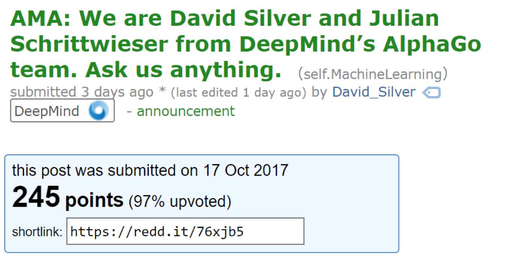
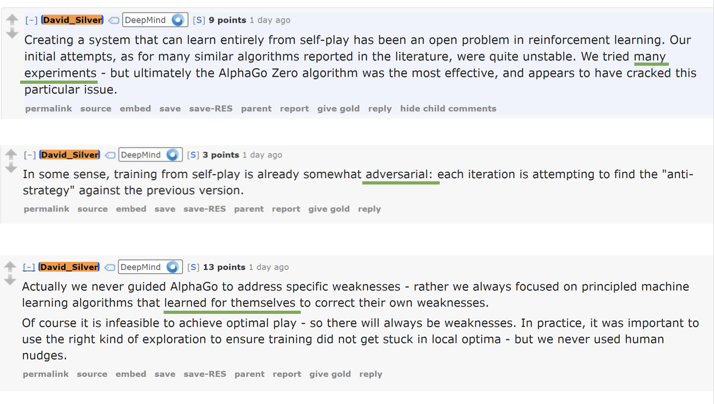

# Six - AlphaGo

A landmark achievement in artificial intelligence.

---

## IBM Deep Blue

{ width=30%, height=30% }

Deep Blue was handcrafted by programmers & chess grandmasters.  AlphaGo *learnt* from human moves & self play.

## Why Go?

Long held as the most challenging classic game for artificial intelligence

- massive search space
- more legal positions than atoms in universe
- difficult to evaluate positions & moves
- sparse & delayed reward

Difficult to evaluate positions

- chess you can evaluate positions by summing the value of all the peices
- Go - it's just stones on the board, equal numbers each side

The width of the search is reduced by the policy network.  The depth of the search is reduced by the value network.

\newpage

## Components of the AlphaGo agent

Three policy networks $\pi(s)$ 

- fast rollout policy network – linear function
- supervised learning policy – 13 layer convolutional NN
- reinforcement learning policy – 13 layer convolutional NN

One value function $V(s)$
- convolutional neural network

Combined together using Monte Carlo tree search

![**Neural network training pipeline and architecture. a, A fast rollout policy $p_{\pi}$ and supervised learning (SL) policy network $p_{\sigma}$ are trained to predict human expert moves in a data set of positions**. A reinforcement learning (RL) policy network $p_{p}$ is initialized to the SL policy network, and is then improved by policy gradient learning to maximize the outcome (that is, winning more games) against previous versions of the policy network. A new data set is generated by playing games of self-play with the RL policy network. Finally, a value network $v_{\theta}$ is trained by regression to predict the expected outcome (that is, whether the current player wins) in positions from the self-play data set.  **b, Schematic representation of the neural network architecture used in AlphaGo**. The policy network takes a representation of the board position $s$ as its input, passes it through many convolutional layers with parameters $\sigma$ (SL policy network) or $p$ (RL policy network), and outputs a probability distribution $p_{\sigma}(a|s)$ or $p_{p}(a|s)$ or represented by a probability map over the board. The value network similarly uses many convolutional layers with parameters $\theta$, but outputs a scalar value $v_{\theta}(s')$ that predicts the expected outcome in position $s'$](../../assets/images/section_6/AG_learning.png){ width=30%, height=30% }

\newpage

## Monte Carlo Tree Search

Value & policy networks combined using MCTS

Basic idea = analyse most promising next moves

Planning algorithm
- simulated (not actual experience)
- roll out to end of game (a simulated Monte Carlo return)

{ width=30%, height=30% }

{ width=30%, height=30% }

{ width=30%, height=30% }

{ width=30%, height=30% }

{ width=30%, height=30% }

## AlphaGo, in context – Andrej Karpathy

[Convenient properties of Go](https://medium.com/@karpathy/alphago-in-context-c47718cb95a5)

- fully deterministic
- fully observed
- discrete action space
- access to perfect simulator
- relatively short episodes 
- evaluation is clear
- huge datasets of human play

DeepMind take advantage of properties of Go that will not be available in real world applications of reinforcement learning.

\newpage

## AlphaGo Zero

Key ideas

- simpler
- search
- adverserial
- machine knowledge only

Training time & performance

- AG Lee trained over several months
- AG Zero beat AG Lee 100-0 after 72 hours of training

Computational efficiency

- AG Lee = distributed w/ 48 TPU
- AG Zero = single machine w/ 4 TPU

{ width=30%, height=30% }

![**Empirical evaluation of AlphaGo Zero. a, Performance of self play reinforcement learning**. The plot shows the performance of each MCTS player $\alpha_{\theta_{i}}$ from each iteration $i$ of reinforcement learning in AlphaGo Zero. Elo ratings were computed from evaluation games between different players, using 0.4 s of thinking time per move (see Methods). For comparison, a similar player trained by supervised learning from 

human data, using the KGS dataset, is also shown. **b, Prediction accuracy on human professional moves**. The plot shows the accuracy of the neural network $\theta f i$, at each iteration of self-play $i$, in predicting human professional moves from the GoKifu dataset. The accuracy measures the percentage of positions in which the neural network assigns the highest probability to the human move. The accuracy of 

a neural network trained by supervised learning is also shown. **c, Mean-squared error (MSE) of human professional game outcomes**. The plot shows the MSE of the neural network $\theta f i$, at each iteration of self-play $i$, in predicting the outcome of human professional games from the GoKifu dataset. The MSE is between the actual outcome $z \in {-1, +1}$ and the neural network value $v$, scaled by a factor of $\frac{1}{4}$ to the range of $0–1$. The MSE of a neural network trained by supervised learning is also shown.](../../assets/images/section_6/Zero_learning_curves.png){ width=30%, height=30% }

### AlphaGo Zero innovations

Learns using only self play

- no learning from human expert games
- no feature engineering
- learn purely from board positions

Single neural network - combine the policy & value networks

MCTS only during acting (not during learning)

Use of residual networks 

### Search in AlphaGo Zero

**Policy evaluation**

Policy is evaluated through self play

This creates high quality training signals - the game result

**Policy improvement**

MCTS is used during acting to create the improved policy

The improved policy generated during acting becomes the target policy during training

[Keynote David Silver NIPS 2017 Deep Reinforcement Learning Symposium AlphaZero](https://www.youtube.com/watch?v=A3ekFcZ3KNw)

\newpage

## DeepMind AlphaGo AMA

{ width=20%, height=20% }

{ width=40%, height=40% }
