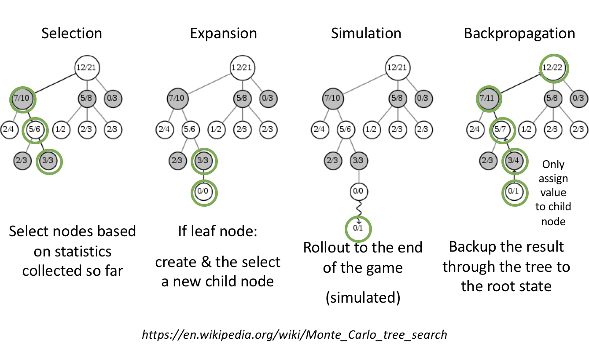
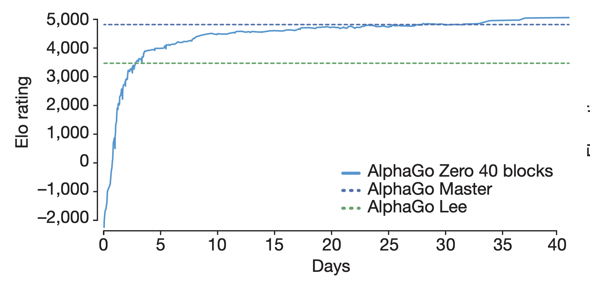

# Six - AlphaGo

A landmark achievement in artificial intelligence.

---

<iframe width="560" height="315" src="https://www.youtube.com/embed/8tq1C8spV_g?rel=0&amp;showinfo=0" frameborder="0" allow="autoplay; encrypted-media" allowfullscreen></iframe>

## IBM Deep Blue

{ width=30%, height=30% }

Deep Blue was handcrafted by programmers & chess grandmasters

AlphaGo *learnt* from human moves & self play

AlphaGo evaluated fewer positions 

-  **width** - policy network select states more intelligently
-  **depth** - value function evaluate states more precisely

## Why Go?

Long held as the most challenging classic game for artificial intelligence

- massive search space
- more legal positions than atoms in universe
- difficult to evaluate positions & moves
- sparse & delayed reward

Difficult to evaluate positions

- chess you can evaluate positions by summing the value of all the peices
- go - it's just stones on the board, equal numbers each side

## Components of the AlphaGo agent

Three policy networks $\pi(s)$ 

- fast rollout policy network – linear function
- supervised learning policy – 13 layer convolutional NN
- reinforcement learning policy – 13 layer convolutional NN

One value function $V(s)$
- convolutional neural network

Combined together using Monte Carlo tree search

{ width=30%, height=30% }

## Monte Carlo Tree Search

Value & policy networks combined using MCTS

Basic idea = analyse most promising next moves

Planning algorithm
- simulated (not actual experience)
- roll out to end of game (a simulated Monte Carlo return)

{ width=30%, height=30% }

## AlphaGo, in context – Andrej Karpathy

[Convenient properties of Go](https://medium.com/@karpathy/alphago-in-context-c47718cb95a5)

- fully deterministic
- fully observed
- discrete action space
- access to perfect simulator
- relatively short episodes 
- evaluation is clear
- huge datasets of human play

DeepMind take advantage of properties of Go that will not be available in real world applications of reinforcement learning.

## AlphaGo Zero

Key ideas

- simpler
- search
- adverserial
- machine knowledge only

Training time & performance

- AG Lee trained over several months
- AG Zero beat AG Lee 100-0 after 72 hours of training

Computational efficiency

- AG Lee = distributed w/ 48 TPU
- AG Zero = single machine w/ 4 TPU

### AlphaGo Zero innovations

Learns using only self play

- no learning from human expert games
- no feature engineering
- learn purely from board positions

Single neural network
- combine the policy & value networks

MCTS only during acting (not during learning)

Use of residual networks 

### Search in AlphaGo Zero

**Policy evaluation**

Policy is evaluated through self play

This creates high quality training signals - the game result

**Policy improvement**

MCTS is used during acting to create the improved policy

The improved policy generated during acting becomes the target policy during training

[Keynote David Silver NIPS 2017 Deep Reinforcement Learning Symposium AlphaZero
](https://www.youtube.com/watch?v=A3ekFcZ3KNw)

## DeepMind AlphaGo AMA

{ width=30%, height=30% }

{ width=30%, height=30% }
